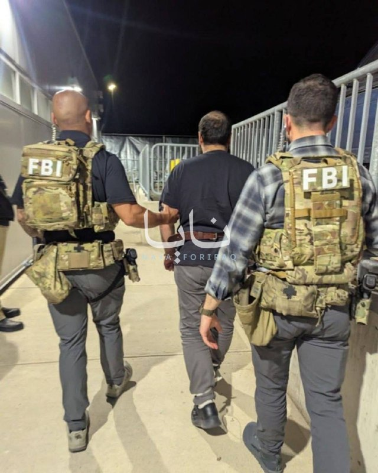

# خواننده تلگرام

<!-- TOP_NAV START -->

<a href="https://github.com/BEST8OY/aio-downloader/blob/main/telegram/content/archive_1.md" style="display:inline-block; padding:6px 12px; margin:0 4px; background-color:#2ea44f; color:white; text-decoration:none; border-radius:4px; font-weight:bold;">صفحه بعد</a>

<!-- TOP_NAV END -->

<!-- MSG START -->

---
📅 بروزرسانی: 1405/02/26 01:48
---

## VahidOOnLine — post 240384

  

♦️نمایندگی دائم جمهوری اسلامی در سازمان ملل متحد روز جمعه ۲۵ اردیبهشت، در پیامی در شبکه اجتماعی اکس نوشت آمریکا تلاش دارد با استفاده از شمار کشورهای حامی پیش‌نویس قطعنامه پیشنهادی خود، تصویری از حمایت گسترده بین‌المللی برای اقداماتش ایجاد کند و زمینه را برای تشدید تنش‌ها در منطقه فراهم سازد.
این نمایندگی افزود: در صورت هرگونه تشدید تنش تازه از سوی آمریکا، کشورهای حامی این قطعنامه نیز در پیامدهای آن شریک خواهند بود و هیچ «توجیه سیاسی» یا «پوشش دیپلماتیک» نمی‌تواند مسئولیت کشورهایی را که در تسهیل و مشروعیت‌بخشی به اقدامات آمریکا نقش دارند، از میان ببرد.
‌🇸🇦 Indypersian

🤖 @VahidOOnLine

## VahidOOnLine — post 240383

  

مایک والتز، سفیر آمریکا در سازمان ملل ، به فاکس‌نیوز گفت: «باید به خاطر داشته باشیم که هیچ دلیلی وجود ندارد که جمهوری اسلامی این گرد و غبار را که شامل ۶۰ درصد اورانیوم با غنای بالا است، در اختیار داشته باشد.»
او گفت:« هیچ کشوری در جهان وجود ندارد که تا آن سطح غنی‌سازی کند و سپس سلاح هسته‌ای نداشته باشد زیرا هیچ دلیلی برای انجام این کار وجود ندارد.»

‌🏁 🇬🇧 IranintlTV

🤖 @VahidOOnLine

## WithYashar — post 11356

## WithYashar — post 11355

## WithYashar — post 11354

نیویورک تایمز به نقل از مقامات آمریکا:

دستیاران ترامپ برنامه‌هایی رو برای بازگشت به حملات نظامی به ایران آماده کردن، اگر او تصمیم بگیره با بمباران بیشتر از بن بست خارج بشه.

از جمله گزینه‌ها، اعزام نیروهای ویژه به ایران برای هدف قرار دادن مواد هسته‌ای مدفون شده است و ممکنه از نیروهای ویژه برای کنترل جزیره خارک استفاده بشه.
@withyashar

## WithYashar — post 11353

  

جلد جدید مجله تایم: چگونه دیدار ترامپ و شی، نظم نوین جهانی را نشان داد
@withyashar

## WithYashar — post 11352

ترامپ خیلی عجله داشته هیچ فیلمی عکسی از رسیدنش نیومده بیرون ! عجبیه

## WithYashar — post 11351

  <a href="telegram/content/WithYashar_11351_1778883501.mp4" target="_blank">🎬 Download video</a>

🎬 Video

## WithYashar — post 11350

حوس لوبیا پلو کردم 😅 امشب که بیداریم درست کنم

## FoxNewsTwitter — post 341799

  

Fox News (Twitter/X)

WATCH LIVE: SpaceX CRS-34 resupply mission launches from Cape Canaveral (Courtesy: SpaceX) https://twitter.com/i/broadcasts/1nGnRYkMkydGO

## pm_afshaa — post 90816

  <a href="telegram/content/pm_afshaa_90816_1778883504.webm" target="_blank">🎬 Download video</a>

🔴نیویورک‌تایمز به نقل از دو مقام امنیتی:
آمریکا و اسرائیل در حال آماده‌سازی گسترده برای احتمال ازسرگیری حملات علیه ایران هستن و ممکنه از هفته آینده آغاز بشه.

💧 Rainbet.com the #1 Non-KYC Crypto Casino & Sportsbook @rainbetcom

😁 @Pm_Afshaa

## pm_afshaa — post 90815

  <a href="telegram/content/pm_afshaa_90815_1778883505.webm" target="_blank">🎬 Download video</a>

🔴نیویورک تایمز:
چند صد نیروی عملیات ویژه آمریکا از ماه مارس وارد منطقه شدن برای سناریوی احتمالی حمله به تأسیسات هسته‌ای زیرزمینی ایران.

الانم بیشتر از 50 هزار نیروی آمریکایی، دو ناو هواپیمابر، ناوشکن‌ها و کلی جنگنده تو منطقه مستقرن.

گفته میشه اگه عملیات زمینی علیه ایران کلید بخوره، نیروهای بیشتری مثل تفنگدارای دریایی و لشکر 82 هوابرد هم وارد عمل میشن.

💧 Rainbet.com the #1 Non-KYC Crypto Casino & Sportsbook @rainbetcom

😁 @Pm_Afshaa

## pm_afshaa — post 90814

  <a href="telegram/content/pm_afshaa_90814_1778883506.webm" target="_blank">🎬 Download video</a>

🔴نیویورک تایمز به نقل از مقامات آمریکا:
دستیاران ترامپ برنامه‌هایی رو برای بازگشت به حملات نظامی به ایران آماده کردن، اگر او تصمیم بگیره با بمباران بیشتر از بن بست خارج بشه.

از جمله گزینه‌ها، اعزام نیروهای ویژه به ایران برای هدف قرار دادن مواد هسته‌ای مدفون شده است و ممکنه از نیروهای ویژه برای کنترل جزیره خارک استفاده بشه.

💧 Rainbet.com the #1 Non-KYC Crypto Casino & Sportsbook @rainbetcom

😁 @Pm_Afshaa

## IranIntlTV — post 337394

  <a href="telegram/content/IranIntlTV_337394_1778883507.mp4" target="_blank">🎬 Download video</a>

دونالد ترامپ در مسیر بازگشت از چین گفت با تعلیق ۲۰ ساله غنی‌سازی اورانیوم در ایران موافق است، به شرط آنکه در این مدت تمام برنامه هسته‌ای تهران پاکسازی شود.

گفت‌وگو با امیر گیتی، عضو تحریریه ایران‌اینترنشنال
@iranintltv

## IranIntlTV — post 337393

  <a href="telegram/content/IranIntlTV_337393_1778883509.mp4" target="_blank">🎬 Download video</a>

🔻مراسم بدرقه تیم ملی با حضور هواداران حکومت در میدان انقلاب تهران برگزار شد و هنگام پخش سرود جمهوری اسلامی، بازیکنان تیم ملی سلام نظامی دادند و تعلق خاطر خود به حکومت را نشان دادند.

🔹توضیحات مزدک میرزایی، ایران اینترنشنال در برنامه هت‌تریک

🔹تماشای نشخه کامل هت‌تریک؛👇
https://youtu.be/v5Exyf8Nyes

@iranintltvsport

## IranIntlTV — post 337392

  

مایک والتز، سفیر آمریکا در سازمان ملل ، به فاکس‌نیوز گفت: «باید به خاطر داشته باشیم که هیچ دلیلی وجود ندارد که جمهوری اسلامی این گرد و غبار را که شامل ۶۰ درصد اورانیوم با غنای بالا است، در اختیار داشته باشد.»
او گفت:« هیچ کشوری در جهان وجود ندارد که تا آن سطح غنی‌سازی کند و سپس سلاح هسته‌ای نداشته باشد زیرا هیچ دلیلی برای انجام این کار وجود ندارد.»

https://iranintl.com/202605157842

## Shin_Persian — post 6023

Shin ✓ @hey_itsmyturn
Fri, 15 May 2026 21:46:56 UTC

Heavy #USAF 🇺🇸 jet activity over Erbil
#KRI, #Iraq 🇮🇶

فارسی

فعالیت سنگین جت‌های نیروی هوایی ایالات متحده (USAF) 🇺🇸 بر فراز اربیل
#KRI، #Iraq 🇮🇶

𝕏 · @shin_persian

## FarsiVOA — post 217861

⚡️گزارش صدای آمریکا از نشست امنیتی نشریه پولیتیکو
@FarsiVOA

## FarsiVOA — post 217860

🔺وزارت دادگستری آمریکا برای فرد متهم به قتل دو کارمند سفارت اسرائيل در واشنگتن درخواست مجازات اعدام می‌کند

◾️دادستان‌ها در آمریکا روز جمعه اعلام کردند که وزارت دادگستری ایالات متحده برای مردی که متهم است دو کارمند سفارت اسرائیل در واشنگتن را در بیرون یک موزه یهودیان با شلیک گلوله کشت، درخواست مجازات اعدام خواهد کرد.

⬇️ بیشتر بخوانید:
https://ir.voanews.com/a/8150497.html
@FarsiVOA

## Persian_Trend_Official — post 14224

  

🔴محمدباقر الساعدی، رهبر حزب‌الله عراق توسط FBI دستگیر شد

🔹الساعدی به دلیل فعالیت‌هایش با گردان‌های حزب‌الله عراق و سپاه پاسداران ایران با شش اتهام روبرو است

💢اداره تحقیقات فدرال آمریکا اعلام کرد «محمد السعدی» که از او به‌عنوان یک هدف باارزش مرتبط با تروریسم بین‌المللی یاد شده، بازداشت و به آمریکا منتقل شده است.

🔻بر اساس بیانیه اف‌بی‌آی:

▪️ السعدی و همدستانش متهم به برنامه‌ریزی، هماهنگی و پذیرش مسئولیت دست‌کم ۲۰ حمله تروریستی در اروپا و کانادا هستند
▪️ مقام‌های آمریکایی مدعی‌اند این شبکه در حال برنامه‌ریزی حملات آینده علیه آمریکا نیز بوده است
▪️ از جمله اهداف احتمالی، مراکز و نهادهای یهودی در نیویورک، کالیفرنیا و آریزونا عنوان شده‌اند

💢اف‌بی‌آی این بازداشت را بخشی از اقدامات دولت ترامپ برای مقابله با تروریسم توصیف کرده است.

🫆:Tony

📌 @persian_trend_official
پرشین ترند | متفاوت‌ترین کانال نظامی

## Persian_Trend_Official — post 14223

  

واقعا احمدی نژاد چه شد ؟!

## IranianMinds — post 20216

🔴 کانال ۱۳ اسرائیل:

برآوردها حاکی از آن است که ترامپ چراغ سبز برای حمله محدود به مواضع رژیم ملاها را خواهد داد

@IranianMinds

## IranianMinds — post 20215

🔴 سازمان ملل: نگرانیم، چون ممکنه منطقه بازم دچار تنش و درگیری بشه

@IranianMinds

## IranianMinds — post 20214

  

🔴جلد جدید مجله تایم:

چگونه دیدار ترامپ و شی، یک نظم نوین جهانی را به نمایش گذاشت.

@IranianMinds

## IranianMinds — post 20213

  

🔴 نیویورک تایمز :

ترامپ پس از بازگشت از چین، در حالی که مشاوران ارشد و مقامات پنتاگون برنامه‌های احتمالی برای حملات مجدد به ایران در صورت شکست مذاکرات صلح را نهایی می‌کردند، وارد آمریکا شد.

اگرچه ترامپ هنوز تصمیم نهایی نگرفته است، گزارش‌ها حاکی از آن است که مقامات آمریکایی و اسرائیلی برای حملاتی که ممکن است طی روزهای آینده آغاز شوند، آماده می‌شوند.

برنامه‌ریزان نظامی درباره گسترش کمپین‌های بمباران و حتی مأموریت‌های عملیات ویژه برای هدف قرار دادن تأسیسات هسته‌ای زیرزمینی ایران بحث کرده‌اند!

@IranianMinds

## BBCPersian — post 281156

  

‌ ‌ ‌ ‌
نخست‌وزیر و وزیر دفاع اسرائیل با صدور بیانیه‌ای اعلام کردند که عزالدین حداد، فرمانده گردان‌‌های عزالدین قسام، شاخه نظامی حماس در غزه را کشته‌اند.

در بیانیه بنیامین نتانیاهو، و اسرائیل کاتس که در رسانه‌های اسرائیلی منتشر شده، آمده است که حداد یکی از «معماران حملات ۷ اکتبر ۲۰۲۳» به اسرائیل بوده است.

طبق این بیانیه، عزالدین حداد از اجرای توافق دونالد ترامپ، رئیس‌جمهور آمریکا، برای خلع سلاح حماس خودداری کرده بود.

یک مقام ارشد امنیتی گفت که نشانه‌های اولیه حاکیست که او کشته شده است.

شاهدان عینی در غزه به بی‌بی‌سی گفتند که یک آپارتمان هدف حمله موشکی قرار گرفت و سپس خودرویی که گفته می‌شود محل را ترک کرده بود، در حمله‌ای دیگر هدف قرار گرفت؛ حمله‌ای که به کشته شدن سه نفر انجامید.

حماس تاکنون کشته شدن عزالدین حداد را نه تایید کرده و نه رد کرده است.

https://bbc.in/4uPJdl1
📷Reuters
@BBCPersian

## BBCPersian — post 281155

🔻 افزایش قیمت نفت و تنش در تنگه هرمز، سود اوراق آمریکا را به بالاترین سطح یک‌سال اخیر رساند

بازده اوراق خزانه‌داری ایالات متحده آمریکا یا سودی که سرمایه‌گذاران برای خرید اوراق بدهی دولت آمریکا مطالبه می‌کنند، روز جمعه به بالاترین سطح یک سال گذشته رسید.

به گزارش رویترز، افزایش قیمت نفت، نگرانی‌ها درباره تورم و انتظار برای قوی‌تر شدن اقتصاد آمریکا باعث شد بازارها پیش‌بینی کنند که نرخ‌های بهره ممکن است برای مدت طولانی‌تری بالا بماند.

قیمت نفت نیز روز جمعه بیش از سه درصد افزایش یافت؛ پس از آن‌که اظهارات دونالد ترامپ و عباس عراقچی، امیدها به توافقی برای پایان دادن به حملات و توقیف کشتی‌ها در اطراف تنگه هرمز را کاهش داد.

دونالد ترامپ گفت که صبرش در قبال ایران رو به پایان است و شی جین‌پینگ، رئیس جمهور چین نیز در دیدار با آقای ترامپ در پکن موافقت کرد که تهران باید تنگه هرمز را بازگشایی کند.

وزیر خارجه ایران هم گفت که تهران به آمریکا «اعتماد ندارد» و تنها در صورتی به مذاکره علاقه‌مند است که واشنگتن جدیت خود را نشان دهد.

https://bbc.in/3PJL9ww
@BBCPersian

## Dirty_Kids — post 389528

  

🔴 طبق گفته دو مقام خاورمیانه‌ای، آمریکا و اسرائیل دارن آماده‌سازی خیلی گسترده‌ای انجام می‌دن. (بزرگ‌ترین سطح از وقتی که آتش‌بس برقرار شده)

این آماده‌سازی‌ها انقدر جدیه که ممکنه از هفته آینده دوباره حملات شروع بشه.

@Dirty_Kids 👻

## Dirty_Kids — post 389526

  <a href="telegram/content/Dirty_Kids_389526_1778883517.mp4" target="_blank">🎬 Download video</a>

امروز یکی تو فضای مجازی با هوش مصنوعی یه عکس از ترامپ و ایلان ماسک زیر پرچم داس و چکشِ کمونیست ساخت؛

بعد تو صداوسیما، خانعلی زاده (کارشناس روابط خارجی و همراه تیم مذاکره کننده تو سفر به پاکستان) خیلی جدی تحلیل کرد که این عکس خروجی سفر ترامپه و این یعنی آمریکا همیشه زیرخوابِ چینه...

@Dirty_Kids 👻

## alonews — post 120293

  <a href="telegram/content/alonews_120293_1778883519.webm" target="_blank">🎬 Download video</a>

👈پک ۱۰عددی کاندوم با افزایش قیمت به ۴۸۰هزار تومان رسیده!

🔴دولت باید به اینجور چیزا سوبسید بده تا همه بتونن استفاده کنن اما.....

✅ @AloNews خبر جنگ

## alonews — post 120292

تعرفه سرویس های Vip 
⭕️ 
✅ 1 گیگابایت 
⬅️ 250/000 تومان 
✅ 3 گیگابایت 
⬅️ 750/000 تومان استارلینک Vip 
💫 
🌟(مناسب برای شرایط بحرانی مثل جنگ و اختلالات) 
⭐️ 5 گیگابایت 
⬅️ 1/400/000 تومان 
⭐️ 10 گیگابایت 
⬅️ 2/800/000 تومان ویژگی های سرویس های Vip : 
❤️‍🔥 
✅ متصل…

## alonews — post 120291

تعرفه سرویس های Vip 
⭕️

✅ 1 گیگابایت 
⬅️ 250/000 تومان

✅ 3 گیگابایت 
⬅️ 750/000 تومان

استارلینک Vip 
💫 
🌟(مناسب برای شرایط بحرانی مثل جنگ و اختلالات)

⭐️ 5 گیگابایت 
⬅️ 1/400/000 تومان

⭐️ 10 گیگابایت 
⬅️ 2/800/000 تومان

ویژگی های سرویس های Vip : 
❤️‍🔥

✅ متصل در تمامی دستگاه و اپراتور ها

✅ مناسب استفاده روزمره در تمامی برنامه ها

✅ دارای ساب برای اطلاع لحظه ای باقیمانده

✅ تک لینک بدون نیاز به بروزرسانی های متعدد
 برای خرید از پشتیبانی به ایدی زیر پیام بدید.
👇

🔤 @expressuport

خرید فوری از ربات.
👇

🔤 @vpn_express_sup_bot

## alonews — post 120290

  <a href="telegram/content/alonews_120290_1778883519.mp4" target="_blank">🎬 Download video</a>

👈مجریان بیسواد صدا و سیما برداشتن یه تصویر هوش مصنوعی رو گذاشتن و دارن تحلیلش میکنن!

✅ @AloNews خبر جنگ

<!-- MSG END -->

<!-- NAV START -->

<a href="https://github.com/BEST8OY/aio-downloader/blob/main/telegram/content/archive_1.md" style="display:inline-block; padding:6px 12px; margin:0 4px; background-color:#2ea44f; color:white; text-decoration:none; border-radius:4px; font-weight:bold;">صفحه بعد</a>

<!-- NAV END -->
