# خواننده تلگرام

<!-- TOP_NAV START -->

<a href="https://github.com/BEST8OY/aio-downloader/blob/main/telegram/content/archive_1.md" style="display:inline-block; padding:6px 12px; margin:0 4px; background-color:#2ea44f; color:white; text-decoration:none; border-radius:4px; font-weight:bold;">صفحه بعد</a>

<!-- TOP_NAV END -->

<!-- MSG START -->

---
📅 بروزرسانی: 1405/02/25 12:59
---

## VahidOOnLine — post 240273

  <a href="telegram/content/VahidOOnLine_240273_1778837377.mp4" target="_blank">🎬 Download video</a>

عباس عراقچی، وزیر خارجه جمهوری اسلامی، در گفتگو با رسانه دولتی هند گفت «هیچ راه‌حل نظامی‌ای وجود ندارد» و افزود ایالات متحده باید این واقعیت را درک کند.

او گفت آمریکا «دست‌کم دو بار» جمهوری اسلامی را آزموده و اکنون به این نتیجه رسیده است که «راه‌حل نظامی وجود ندارد».

عراقچی مهم‌ترین مشکل در روند کنونی را «پیام‌های متناقض» از سوی مقام‌های آمریکایی دانست و گفت این پیام‌ها از طریق اظهارنظرها، مصاحبه‌ها و مواضع مختلف دریافت می‌شود.
‌🏁 🇬🇧 ManotoTV

🤖 @VahidOOnLine

## VahidOOnLine — post 240272

  <a href="telegram/content/VahidOOnLine_240272_1778837377.mp4" target="_blank">🎬 Download video</a>

رسانه دولتی اسرائیل گزارش داد ایال زامیر، رئیس ستاد ارتش اسرائیل، در جریان جنگ با ایران به امارات متحده عربی سفر کرده است.
بر اساس این گزارش، او همراه با چند مقام نظامی اسرائیل با مقام‌های اماراتی، از جمله محمد بن زاید، رئیس امارات، دیدار کرده است. ارتش اسرائیل تاکنون واکنشی به این گزارش نشان نداده است.
این گزارش پس از آن منتشر می‌شود که بنیامین نتانیاهو نیز گفته بود در زمان جنگ به امارات سفر کرده؛ ادعایی که از سوی امارات رد شد. همچنین گزارش‌هایی درباره سفر رؤسای سازمان‌های اطلاعاتی و امنیتی اسرائیل به امارات در زمان جنگ منتشر شده است.
در همین حال، مقام‌های آمریکایی تأیید کرده‌اند اسرائیل یک سامانه پدافند موشکی را به همراه نیروهای نظامی برای راه‌اندازی آن به امارات منتقل کرده است.
‌🏁 🇬🇧 ManotoTV

🤖 @VahidOOnLine

## VahidOOnLine — post 240271

  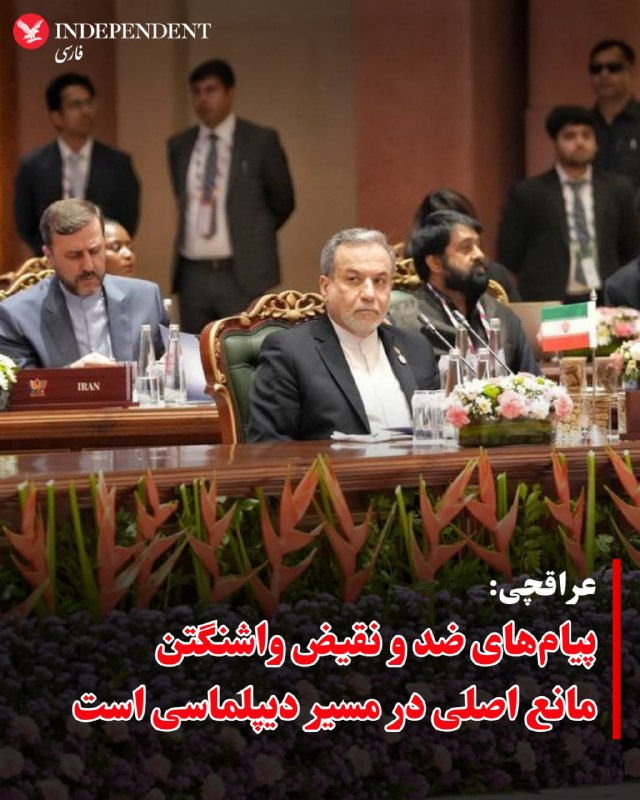

⭕️عراقچی: پیام‌های ضد و نقیض واشنگتن مانع اصلی در مسیر دیپلماسی است

♦️عباس عراقچی، وزیر امور خارجه ایران، روز جمعه ۲۵ اردیبهشت ماه، در پایان نشست وزرای خارجه بریکس در هند، در گفتگو با رسانه‌های این کشور گفت هیچ راهکار نظامی برای بحران خاورمیانه وجود ندارد و ایالات متحده باید بداند که از مسیر نظامی به اهداف خود نخواهد رسید.

عراقچی با اشاره به آمادگی تهران برای تعامل دیپلماتیک، «پیام‌های ضد و نقیض واشنگتن» را مانع اصلی این مسیر توصیف کرد: «ما تعامل را آغاز کرده‌ایم، اما موانع زیادی در این مسیر وجود دارد؛ که مهم‌ترین آن‌ها، پیام‌های ضد و نقیضی است که از سوی آمریکایی‌ها در گفتگوها و مصاحبه‌هایشان دریافت می‌کنیم.»

 وزیرامور خارجه جمهوری اسلامی همچنین گفت ایران شروع‌کننده جنگ نبوده و تنها در حال «دفاع مشروع« از خود است. او بار دیگر تاکید کرد تنگه هرمز برای «کشورهای دوست» بسته نیست و تنها برای «دشمنان» محدود شده است. عراقچی گفت: « کشتی‌های متعلق به سایر کشورها فقط باید عبور خود را با نیروهای نظامی ما هماهنگ کنند تا از هرگونه مانع احتمالی جلوگیری شده و عبوری ایمن داشته باشند. در روزهای گذشته نیز کشتی‌های زیادی با کمک نیروهای دریایی ما از تنگه عبور کرده‌اند و این روند ادامه خواهد داشت.»

عباس عراقچی در پایان، تنها راه تضمین قطعی امنیت دریانوردی برای همه طرف‌ها را پایان دادن به جنگ عنوان کرد.
‌🇸🇦 Indypersian

🤖 @VahidOOnLine

## VahidOOnLine — post 240270

  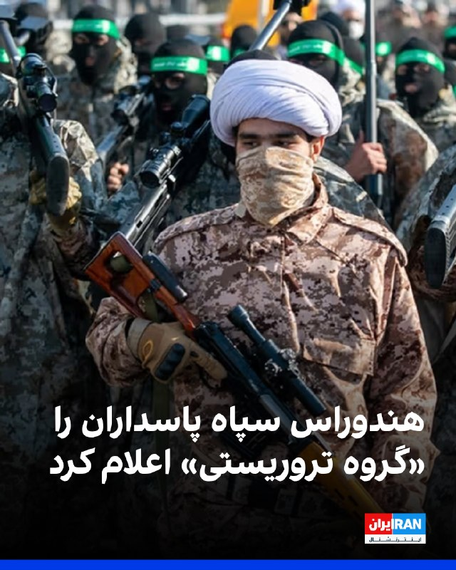

هندوراس به‌طور رسمی سپاه پاسداران انقلاب اسلامی و حماس را در فهرست گروه‌های تروریستی قرار داد. وزارت خارجه هندوراس در بیانیه‌ای اعلام کرد این تصمیم در راستای موضع ثابت هندوراس در محکومیت تروریسم و تامین مالی آن «در تمامی اشکال و مظاهر» اتخاذ شده و نشان‌دهنده تعهد این کشور به همکاری‌های بین‌المللی برای پیشگیری و مقابله با تهدیدات تروریستی است.

گیدئون سعار، وزیر خارجه اسرائیل، با انتشار پیامی در ایکس، از دولت هندوراس بابت اقدام علیه سپاه و حماس تمجید کرد.

در این پیام آمده است: «این اقدام گام مهم دیگری برای تقویت جبهه جهانی مبارزه با تروریسم است؛ تروریسمی که امنیت سراسر جهان، از جمله آمریکای لاتین، را تهدید می‌کند.»
‌🏁 🇬🇧 IranintlTV

🤖 @VahidOOnLine

## VahidOOnLine — post 240269

  

عباس عراقچی، وزیر خارجه جمهوری اسلامی، در مصاحبه با صداوسیما در حاشیه اجلاس بریکس در هند گفت: «جنگ به نقطه عطفی در منطقه تبدیل شده و جایگاه ایران را ارتقا داده است.»

به گفته او، جمهوری اسلامی در جریان درگیری‌های اخیر، «اهداف آمریکایی» را در خاک امارات متحده عربی هدف قرار داد.
‌🏁 🇬🇧 IranintlTV

🤖 @VahidOOnLine

## VahidOOnLine — post 240268

  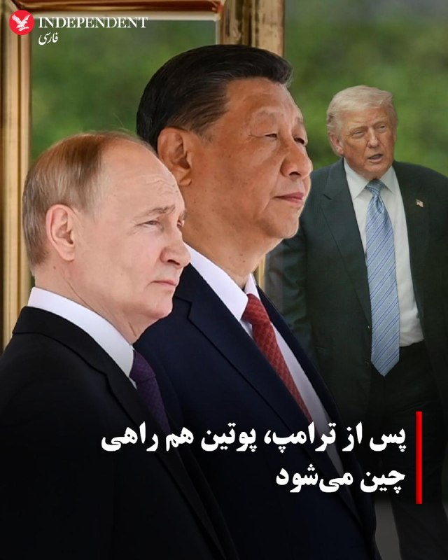

♦️ولادیمیر پوتین، رئیس‌جمهوری روسیه، قرار است هفته آینده و فقط چند روز پس از نشست تاریخی شی جین‌پینگ و دونالد ترامپ در پکن، به چین سفر کند.
بر اساس گزارش روزنامه «ساوت چاینا مورنینگ پست»، این سفر «یک روزه» احتمالا روز ۲۰ مه (۳۰ اردیبهشت) انجام خواهد شد.
کرملین پیش‌تر اعلام کرده بود که سفر پوتین به چین «در آینده‌ای بسیار نزدیک» انجام خواهد شد و مقدمات آن نهایی شده است.
زمان‌بندی این سفر در شرایطی مورد توجه قرار گرفته که پکن همزمان در حال مدیریت روابط خود با واشنگتن و مسکو است. دیدار اخیر شی و ترامپ بر موضوعاتی از جمله جنگ ایران، تجارت و مسائل ژئوپلیتیک متمرکز بود و سفر قریب‌الوقوع پوتین می‌تواند نشانه‌ای از ادامه هماهنگی نزدیک میان روسیه و چین تلقی شود.
‌🇸🇦 Indypersian

🤖 @VahidOOnLine

## VahidOOnLine — post 240267

  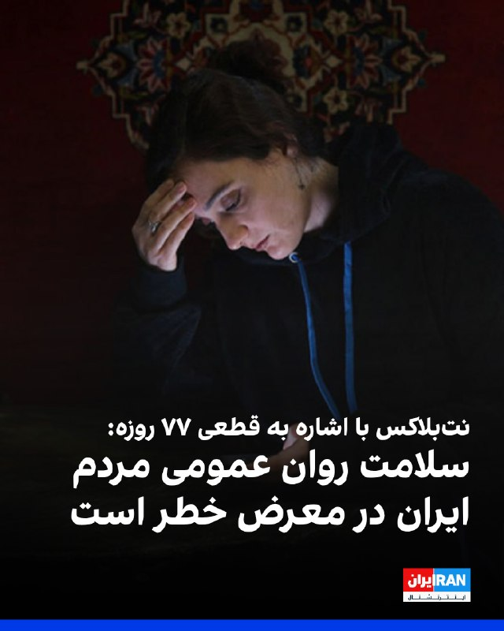

نت‌بلاکس خبر داد که قطعی اینترنت در ایران از هزار و ۸۲۴ ساعت گذشته و وارد هفتادوهفتمین روز شده است.
نت‌بلاکس نوشت: در پی تداوم قطع اینترنت در ایران، بخش زیادی از مردم از ارتباطات آنلاین و تعامل با جهان خارج محروم شده‌اند و نگرانی‌ها درباره پیامدهای روانی افزایش یافته است.
‌🏁 🇬🇧 IranintlTV

🤖 @VahidOOnLine

## VahidOOnLine — post 240266

⭕️لاوروف در نشست بریکس: ایران عامل انسداد تنگه هرمز نیست، می‌خواهند بین تهران و همسایگانش تفرقه ایجاد کنند

♦️سرگئی لاوروف، وزیر امور خارجه روسیه، روز جمعه ۲۵ اردیبهشت  با انتقاد از رویکرد «غرب» در خلیج فارس، گفت: «ریشه اصلی تنش‌های منطقه تجاوز بی‌دلیل آمریکا و اسرائیل علیه ایران» است.

سرگئی لاوروف که برای شرکت در نشست وزاری امور خارجه کشورهای عضو بریکس در دهلی نو حضور دارد گفت: «تا پیش از آغاز جنگ در اسفند ماه گذشته، امنیت دریانوردی در تنگه هرمز به صورت ۱۰۰ درصدی تضمین شده بود و ایران هرگز عامل ایجاد مشکل در این آبراه نبوده است.»

براساس گزارش‌های غیررسمی، روسیه در جریان جنگ و پیش از آتش‌بس به جمهوری اسلامی کمک‌های اطلاعاتی ارائه می‌داده است. روابط نظامی و امنیتی تهران و مسکو از زمان جنگ اوکراین دوچندان شده است.

 لاروف بار دیگر گفت یکی از اهداف آمریکا و اسرائیل در جنگ با جمهوری اسلامی «ایجاد تفرقه میان ایران و همسایگان عربش» است و با اشاره به تلاش‌های دیپلماتیک جاری، از نقش پاکستان در تسهیل گفتگو میان ایران و آمریکا و همچنین پتانسیل هند به عنوان میانجی برای بهبود روابط ایران و کشورهای عربی به دلیل اعتبار و نفوذ دیپلماتیک دهلی‌نو حمایت کرد.
‌🇸🇦 Indypersian

🤖 @VahidOOnLine

## VahidOOnLine — post 240265

  <a href="telegram/content/VahidOOnLine_240265_1778837382.mp4" target="_blank">🎬 Download video</a>

یکی از مخاطبان ایران‌اینترنشنال که دانش‌آموز پایه دهم انسانی است می‌گوید با وجود نهایی نبودن امتحان‌های امسال، نگران سال آینده است، چون به گفته او کیفیت آموزش و شرایط یادگیری در سال جاری «افتضاح» بوده و دانش‌آموزان عملا چیزی یاد نگرفته‌اند. او می‌گوید در مدرسه غیردولتی تحصیل می‌کند.
این پیام با هوش مصنوعی خوانده شده است.
‌🏁 🇬🇧 IranintlTV

🤖 @VahidOOnLine

## VahidOOnLine — post 240264

  <a href="telegram/content/VahidOOnLine_240264_1778837384.mp4" target="_blank">🎬 Download video</a>

دفتر رسانه‌ای دولت ابوظبی روز جمعه ۲۵ اردیبهشت اعلام کرد امارات متحده عربی ساخت یک خط لوله نفتی تازه را برای افزایش صادرات از مسیر فجیره تسریع می‌کند.

این پروژه قرار است تا سال ۲۰۲۷ ظرفیت صادرات نفت امارات از فجیره را دو برابر کند و توان این کشور برای دور زدن تنگه هرمز را افزایش دهد.

فجیره در ساحل دریای عمان قرار دارد و نفتکش‌ها از این مسیر می‌توانند بدون عبور از تنگه هرمز بارگیری کنند.
‌🏁 🇬🇧 ManotoTV

🤖 @VahidOOnLine

## VahidOOnLine — post 240263

  <a href="telegram/content/VahidOOnLine_240263_1778837385.mp4" target="_blank">🎬 Download video</a>

گروه ناظر اینترنتی نت‌بلاکس اعلام کرد قطعی اینترنت در ایران امروز وارد هفتادوهفتمین روز خود شده و از مرز ۱۸۲۴ ساعت گذشته است.
نت‌بلاکس هشدار داده ادامه این محدودیت‌ها می‌تواند به یک خطر فزاینده برای سلامت روان شهروندان تبدیل شود؛ شهروندانی که تا حد زیادی از پلتفرم‌های آنلاین، ارتباطات و تعامل عادی با جهان خارج محروم شده‌اند.
‌🏁 🇬🇧 ManotoTV

🤖 @VahidOOnLine

## VahidOOnLine — post 240262

  <a href="telegram/content/VahidOOnLine_240262_1778837385.mp4" target="_blank">🎬 Download video</a>

دونالد ترامپ، رئیس‌جمهوری آمریکا، پس از پایان سفر دو روزه خود به چین، روز جمعه پکن را ترک کرد.
ترامپ با هواپیمای اختصاصی ریاست‌جمهوری آمریکا «ایر فورس وان» از چین خارج شد و وانگ یی، وزیر امور خارجه چین، به همراه هیاتی دیپلماتیک او را بدرقه کرد.
‌🏁 🇬🇧 ManotoTV

🤖 @VahidOOnLine

## VahidOOnLine — post 240261

🗣روایت شما از زندگی در آتش‌بس- جمعه ۲۶ اردیبهشت ۱۴۰۵

🔹از مشهد پیام می‌دهم. واقعاً ما از این بلاتکلیفی خسته شدیم، گرانی بیداد می‌کند، دخل و خرج‌مان با هم همخوانی ندارد، باید ده نفر کار کنیم که یک نفر بتواند بخورد.

🔹یادم هست اینترنت غزه فقط چند روز قطع بود، کل دنیا و سازمان ملل گفتند جنایت جنگی است، علیه بشریت است و کلی فشار آوردند به اسرائیل و گفتند می‌خواهد حقایق جنگ در غزه را سرکوب کند. هی روزگار.

🔹یک عدد مرغ یک‌میلیون تومان شده است، ما چند ماه پیش با این رقم چهار عدد مرغ خریداری می‌کردیم، دیگر نمی‌دانم چه بگویم، باز ارزشی‌ها بروند بیرون شعار بدهند.

🔹از ملارد تهران، ما خیلی بدبختیم، به کی بگوییم آخه آب را روزی سه مرتبه قطع می‌کنند، بعدازظهرها از ساعت ۶ تا فردا ۶ صبح کلاً قطع می‌کنند، با این همه بارندگی باز می‌گویند آب کم است. با همه این قطعی‌ها قبض آب نجومی می‌آید.

🔹در مشهد، محله‌ی دلاوران. به هزار و یک بدبختی توانستیم وصل شویم، اینترنت نداریم، بنزین نداریم. از دوازده شب به بعد باید تو صف بنزین بایستی، شاید بنزین گیرت آمد، الان حتی بنزین پنج‌تومانی هم نمی‌دهند.

🔹من از تهران پیام می‌دهم، اوضاع واقعاً داغون است، شرکت‌ها همه تعطیل شدند و تعدیل نیرو می‌کنند، شرکت سیماران از ۶۰۰ پرسنل فقط ۵۰ نفر را نگه داشتند و بقیه را اخراج کردند.
‌🏁 🇬🇧 IranintlTV

🤖 @VahidOOnLine

## VahidOOnLine — post 240260

  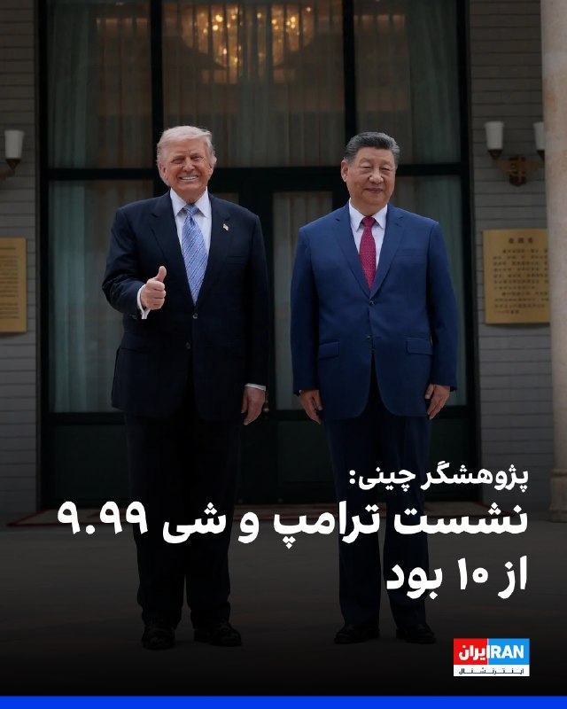

یک پژوهشگر مسائل چین در گفت‌وگو با سی‌ان‌ان نشست دونالد ترامپ و شی جین‌پینگ را «۹.۹۹ از ۱۰» ارزیابی کرد و آن را رویدادی تاریخی توصیف کرد.

ویکتور گائو، مترجم پیشین انگلیسی دنگ شیائوپینگ، رییس‌جمهور پیشین چین، و استاد ممتاز دانشگاه سوچو، گفت: «بسیار موفق، با برنامه‌ریزی دقیق، اما در عین حال همراه با خودجوشی و هیجان فراوان.»

او افزود: «چین بهترین عملکرد خود را ارائه داد. مقام‌های دولتی آمریکا و همچنین رهبران تجاری نیز کار درست را انجام دادند. بنابراین این واقعا یک لحظه تاریخی است.»

گائو همچنین از اقدام دونالد ترامپ برای از سرگیری سفرهای ریاست‌جمهوری آمریکا به چین استقبال کرد و آن را «گامی مهم در مسیر درست» برای روابط دو کشور دانست. او یادآور شد روسای‌جمهوری آمریکا از زمان رونالد ریگان دست‌کم یک بار در دوره مسئولیت خود به چین سفر کرده بودند، اما جو بایدن، رییس‌جمهوری سابق آمریکا، در فاصله ژانویه ۲۰۲۱ تا ژانویه ۲۰۲۵ چنین سفری انجام نداد.

این پژوهشگر انتخاب معبد بهشت در پکن برای دیدار دو رهبر را نیز معنادار خواند و گفت در گذشته امپراتورها در آنجا برای برداشت خوب، صلح و ثبات دعا می‌کردند.
‌🏁 🇬🇧 IranintlTV

🤖 @VahidOOnLine

## VahidOOnLine — post 240259

  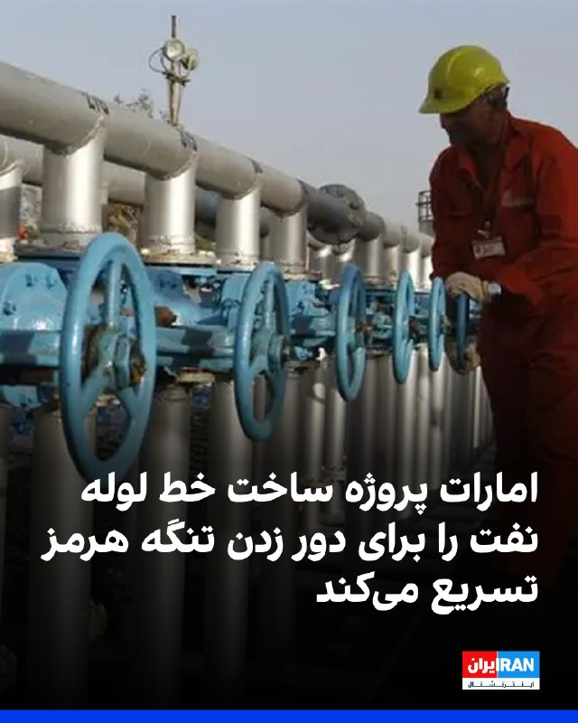

دفتر رسانه‌ای دولت ابوظبی روز جمعه اعلام کرد امارات متحده عربی ساخت یک خط لوله جدید نفت را برای دو برابر کردن ظرفیت صادراتی خود از طریق فجیره تا سال ۲۰۲۷ تسریع می‌کند؛ اقدامی که توان این کشور برای دور زدن تنگه هرمز را به طور چشمگیری افزایش می‌دهد.

بر اساس اعلام این دفتر، شیخ خالد بن محمد بن زاید، ولیعهد ابوظبی، در نشست کمیته اجرایی به شرکت ملی نفت ابوظبی، ادنوک، دستور داد پروژه خط لوله غرب-شرق را با سرعت بیشتری پیش ببرد. این دفتر افزود این خط لوله در حال ساخت است و انتظار می‌رود در سال ۲۰۲۷ آغاز به کار کند. در این گزارش به جدول زمانی اولیه اجرای پروژه اشاره‌ای نشده است.

خط لوله موجود نفت خام ابوظبی که با نام خط لوله حبشان-فجیره نیز شناخته می‌شود، توان انتقال روزانه تا ۱.۸ میلیون بشکه نفت را دارد و در شرایطی که این کشور در پی افزایش صادرات مستقیم از سواحل خلیج عمان است، نقشی حیاتی ایفا کرده است.
‌🏁 🇬🇧 IranintlTV

🤖 @VahidOOnLine

## VahidOOnLine — post 240258

  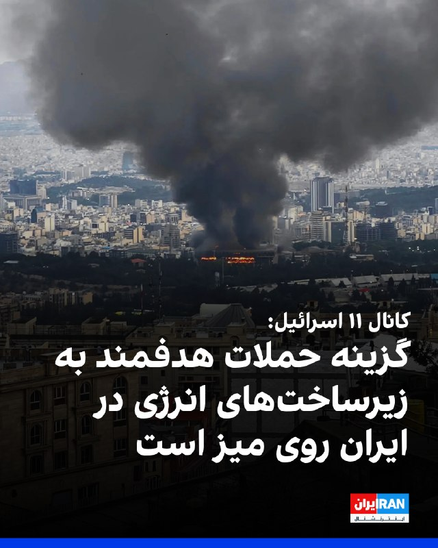

بر اساس این گزارش، در رایزنی‌های اخیر گزینه انجام حملات محدود و هدفمند آمریکا علیه تاسیسات سوخت و انرژی در ایران مطرح شده است.

کانال ۱۱ افزود اسرائیل برای چنین سناریویی در حال آماده‌سازی است؛ از جمله آمادگی برای واکنش احتمالی جمهوری اسلامی و ازسرگیری حملات موشکی به سوی اسرائیل.
‌🏁 🇬🇧 IranintlTV

🤖 @VahidOOnLine

## VahidOOnLine — post 240257

  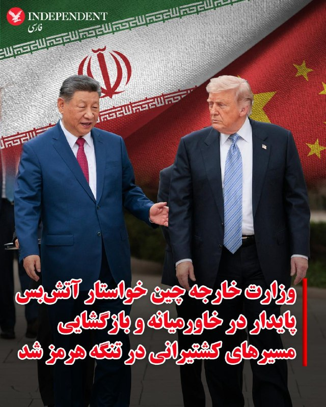

♦️وزارت خارجه چین روز جمعه ۲۵ اردیبهشت ماه، در بیانیه‌ای خواستار برقراری آتش‌بسی پایدار در خاورمیانه و بازگشایی هرچه سریع‌تر مسیرهای کشتیرانی شد.
وزارت خارجه چین در واکنش به پرسش‌هایی درباره گفتگوهای دونالد ترامپ و شی جین‌پینگ اعلام کرد پکن امیدوار است «در سریع‌ترین زمان ممکن» آتش‌بسی پایدار برقرار شود تا صلح و ثبات به خاورمیانه بازگردد.
این وزارتخانه همچنین تاکید کرد: «مسیرهای کشتیرانی باید در پاسخ به درخواست جامعه جهانی هرچه سریع‌تر بازگشایی شوند.»
در بیانیه وزارت خارجه چین درباره بحران خاورمیانه آمده است: «ادامه این درگیری که اساسا نباید رخ می‌داد، هیچ فایده‌ای ندارد.»
به گزارش خبرگزاری فرانسه، این بیانیه پس از آن منتشر شد که دونالد ترامپ به شبکه فاکس نیوز گفت در مورد احتمال دستیابی به یک توافق صلح با ایران «دیگر خیلی صبور نخواهد ماند.» ترامپ پس از نخستین روز گفتگو با همتای چینی‌اش، در گفتگو با فاکس‌نیوز افزود شی به او اطمینان داده که چین قصد ندارد کمک نظامی به ایران ارائه کند.
تنگه هرمز در شرایط عادی مسیر انتقال حدود یک‌پنجم نفت و گاز طبیعی مایع جهان و دیگر کالاهای راهبردی است. در همین حال سپاه پاسداران روز پنج‌شنبه اعلام کرد نیروهای دریایی ایران از چهارشنبه شب به تعدادی از کشتی‌های چینی اجازه عبور از تنگه هرمز را داده‌اند.
‌🇸🇦 Indypersian

🤖 @VahidOOnLine

## VahidOOnLine — post 240256

  

دونالد ترامپ، رییس‌جمهوری آمریکا، روز جمعه پس از سفری دو روزه سوار هواپیمای اختصاصی ریاست‌جمهوری آمریکا «ایر فورس وان» شد و پکن را ترک کرد. وانگ یی، وزیر امور خارجه چین، ترامپ را پیش از سوار شدن به هواپیما همراه با هیاتی دیپلماتیک بدرقه کرد.

شی جین‌پینگ، رییس‌جمهوری چین، در سخنرانی خود در مراسم ضیافت رسمی به مناسبت سفر دونالد ترامپ، این سفر را «تاریخی» خواند و گفت: «دو شعار "احیای چین" و "عظمت را به آمریکا بازگردانیم" می‌توانند در کنار یکدیگر پیش بروند.»
‌🏁 🇬🇧 IranintlTV

🤖 @VahidOOnLine

## VahidOOnLine — post 240255

  <a href="telegram/content/VahidOOnLine_240255_1778837390.mp4" target="_blank">🎬 Download video</a>

اف‌بی‌آی اعلام کرد برای دریافت اطلاعاتی که به شناسایی و بازداشت «مونیکا ویت»، مامور سابق ضدجاسوسی و متخصص اطلاعاتی نیروی هوایی آمریکا، منجر شود ۲۰۰ هزار دلار جایزه تعیین کرده است.
بر اساس بیانیه اف‌بی‌آی، ویت بین سال‌های ۱۹۹۷ تا ۲۰۰۸ در نیروی هوایی آمریکا خدمت کرده و سپس تا سال ۲۰۱۰ به‌عنوان پیمانکار دولت آمریکا فعالیت داشته است. او به اطلاعات محرمانه و فوق‌محرمانه، از جمله هویت نیروهای مخفی جامعه اطلاعاتی آمریکا، دسترسی داشته است. مقام‌های آمریکایی می‌گویند او پس از شرکت در نشست‌هایی مرتبط با برنامه «افق نو» در تهران، به ایران پناهنده شد و اطلاعات حساسی را در اختیار جمهوری اسلامی قرار داد.
وزارت دادگستری آمریکا پیش‌تر او را به همکاری در عملیات جاسوسی سایبری، افشای اطلاعات محرمانه و به خطر انداختن جان نیروهای آمریکایی و خانواده‌هایشان متهم کرده بود. اف‌بی‌آی می‌گوید مونیکا ویت همچنان متواری است و احتمال می‌دهد افرادی از محل اختفای او اطلاع داشته باشند.
‌🏁 🇬🇧 ManotoTV

🤖 @VahidOOnLine

## VahidOOnLine — post 240254

  <a href="telegram/content/VahidOOnLine_240254_1778837391.mp4" target="_blank">🎬 Download video</a>

ارتش اسرائیل اعلام کرد در پی فعال شدن آژیر هشدار در مناطق مسد و عیلابون، یک پرتابه شلیک‌شده از خاک لبنان به سوی اسرائیل رهگیری شده است. به گفته ارتش اسرائیل، این اقدام «نقض دیگری از تفاهم‌های آتش‌بس» از سوی حزب‌الله به شمار می‌رود.
همزمان ارتش اسرائیل اعلام کرد یک سرباز این کشور شب گذشته بر اثر شلیک خمپاره حزب‌الله در جنوب لبنان کشته شده است. سرباز کشته‌شده، گروهبان دوم نگو داگان، ۲۰ ساله، از گردان دوازدهم تیپ گولانی و اهل شهرک دکل در جنوب اسرائیل معرفی شده است.
ارتش اسرائیل همچنین اعلام کرد شب گذشته سکوی پرتابی را که حزب‌الله از آن چندین راکت به سوی منطقه کریات شمونا شلیک کرده بود، در منطقه زبدین در جنوب لبنان هدف قرار داده و منهدم کرده است. به گفته ارتش، چندین ساختمان مورد استفاده حزب‌الله برای اهداف نظامی نیز در این حملات هدف قرار گرفته‌اند.
‌🏁 🇬🇧 ManotoTV

🤖 @VahidOOnLine

## WithYashar — post 11273

😂😂🙌🏾 @withyashar

## WithYashar — post 11272

ترامپ در تروث : پژوهشگر چینی به CNN گفت که به نشست ترامپ و شی نمره «۹.۹۹ از ۱۰» می‌دهد.
@withyashar

## WithYashar — post 11271

  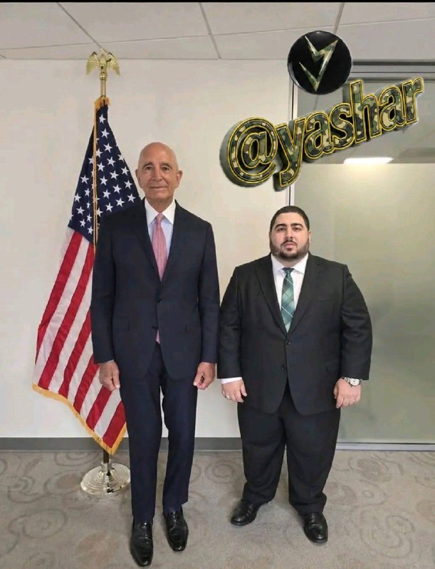

محمد قنطاری، کاردار جدید سوریه در واشنگتن دی سی😬🍔
@withyashar

## WithYashar — post 11270

@withyashar part3

## WithYashar — post 11269

  

😂😂🙌🏾 @withyashar

## WithYashar — post 11268

هم‌اکنون حمله سنگین جمهوری اسلامی به مقر گروه های مخالف در عراق
@withyashar

## WithYashar — post 11267

طبق گزارش روزنامه «ساوت چاینا مورنینگ پست» و بازنشر آن توسط «بلومبرگ»، انتظار می‌رود «ولادیمیر پوتین» در حدود ۲۰ مه به «پکن» سفر کند؛ تنها حدود ۵ روز پس از دیدار «شی جین‌پینگ» و «دونالد ترامپ» در پکن.

رسانه‌ها می‌گویند این سفر احتمالاً فقط یک روز طول می‌کشد و بیشتر در قالب یک دیدار کاری و هماهنگی سیاسی انجام می‌شود. همچنین برخلاف سفر ترامپ، ظاهراً خبری از تشریفات بزرگ، رژه رسمی یا استقبال بسیار گسترده نخواهد بود و این سفر در سطحی ساده‌تر و کم‌نمایش‌تر برگزار می‌شود
@withyashar

## WithYashar — post 11266

@withyashar part2

## WithYashar — post 11265

ترامپ در تروث : «وقتی رئیس‌جمهور شی با بیانی بسیار سنجیده از ایالات متحده به‌عنوان کشوری که شاید در حال افول باشد یاد کرد، منظور او آسیب عظیمی بود که ما در چهار سال دوران جو بایدنِ خواب‌آلود و دولت بایدن متحمل شدیم؛ و در این مورد، او صددرصد درست می‌گفت. کشور…

## WithYashar — post 11264

@withyashar part1

## WithYashar — post 11263

  <a href="telegram/content/WithYashar_11263_1778837393.mp4" target="_blank">🎬 Download video</a>

@withyashar منتظر ری اکشننن

## WithYashar — post 11262

نظرت چیه؟قبل جام جهانی میزنع یا بعد؟

## WithYashar — post 11261

کانال 13 اسرائیل:اسرائیل انتظار دارد حمله احتمالی آمریکا در ایران از فردا با بازگشت ترامپ از چین آغاز شود
@withyashar

## WithYashar — post 11260

  <a href="telegram/content/WithYashar_11260_1778837395.mp4" target="_blank">🎬 Download video</a>

پایان سفر ترامپ به چین

دونالد ترامپ، رئیس جمهور آمریکا، پکن را ترک کرد و سفر خود به جمهوری خلق چین را به پایان رساند.

شی جین‌پینگ، رئیس‌جمهور چین در آخرین روز سفر رئیس جمهور ایالات متحده گفت که دونالد ترامپ به دنبال بازگرداندن عظمت آمریکا است و او نیز متعهد به هدایت مردم چین برای تحقق رستاخیز ملی است.

شی جین‌پینگ همچنین تأکید کرده است که چین و آمریکا می‌توانند از طریق تقویت همکاری‌ها، روند توسعه و پیشرفت خود را تسریع کنند.
@withyashar

## WithYashar — post 11259

  <a href="telegram/content/WithYashar_11259_1778837397.mp4" target="_blank">🎬 Download video</a>

ترامپ: امیدوارم ایران تماشا کند. ما دقیقاً می‌دانیم چه چیزی را آماده کرده‌اند. می‌دانید، آن‌ها کمی استراحت داشتند، بنابراین سعی دارند چند چیز را با هم جمع کنند. آن‌ها موشک‌هایی را از زیر زمین بیرون آورده‌اند. همه این‌ها در یک روز از بین خواهند رفت. امیدوارم این رو ببینند چون همه کارهایی که در چهار هفته گذشته انجام داده‌اند، در یک روز از بین خواهد رفت.
@withyashar
یاشار:خوب دیگه رسمأ داره میگه جنگ میشه و هم داره میگه حمله خیلی سریع و محکم انجام میشه همانطور که گفتیم

## WithYashar — post 11258

آمریکا پیشنهاد ۱۴ ماده‌ای ایران را رد کرد

طبق اطلاعات رسیده به تهران تایمز، دولت آمریکا پاسخ پیشنهاد مکتوب ایران درباره پایان جنگ را داده است.

گفتنی است ایران پیشنهاد خود را مبتنی بر مذاکرات دو مرحله ای ارائه کرده بود که در مرحله اول منجر به پایان جنگ در همه جبهه ها شده و در صورت تحقق شروط ایران، مرحله دوم مذاکرات که درباره موضوع هسته ای بود، آغاز می شد
@withyashar

## mwarmonitor — post 9109

🔴ابراهیم عزیزی، رییس کمیسیون امنیت ملی مجلس، از تدوین طرحی با عنوان «اقدام متقابل نیروهای نظامی و امنیتی جمهوری اسلامی» خبر داد که در آن پرداخت پاداش ۵۰ میلیون یورویی برای کشتن دونالد ترامپ، رییس‌جمهوری آمریکا، پیش‌بینی شده است.

📝ترامپ در راه بازگشت از چین، در حالی که طعم قدرت مطلق زیر زبانش است، با دیدن این طرحِ مضحکِ ۵۰ میلیون یورویی، فقط یک پوزخند به ریشِ کلِ این نظامِ مفلوک می‌زند. او می‌داند این زوزه‌های مجلس، ناله از سرِ وحشتِ موجوداتی است که حس می‌کنند طنابِ دارِ تاریخ دور گردن‌شان سفت شده است.

🔸​آن «بچه شیعه‌های رافضی» و مزدورانِ دوزاری که با مغزهای شست‌وشو داده شده، به طمعِ پاداشی که حتی سیستم بانکیِ داغانِ خودشان هم توانِ جابه‌جایی‌اش را ندارد، خوابِ «رسالت دینی» می‌بینند، نمی‌دانند که ترامپِ عصبانی، نقشه‌ی آخرت‌شان را خیلی وقت است کشیده. او برمی‌گردد تا نه فقط این طرح‌های کاغذی، بلکه کلِ بساطِ این سیرکِ ولایی را به توالتِ تاریخ بسپارد. برای این پادوهای بی‌مغز، بهشت و حوری در کار نیست؛ ترامپ چنان جهنمی روی زمین برایشان می‌سازد که پودر شدن توسط پهپادهای سنتکام، در برابرش مثل یک نوازشِ لطیف باشد. او می‌آید تا با یک حرکت، کلِ این لجن‌زار و مزدورانِ پست‌فطرتش را چنان به گُه بکشد که حتی نامی از این «اقدام متقابل» مضحک در تاریخ باقی نماند.

@mwarmonitor

## mwarmonitor — post 9108

علی هاشم خبرنگار الجزیره:

🇮🇷«یک منبع آگاه ایرانی به من گفته است که تهران به‌طور رسمی پاسخ آمریکا به پیشنهاد ایران را دریافت کرده و واشنگتن تمامی شروط ایران را به‌طور کامل رد کرده است.

🔸تیم مذاکره‌کننده ایران پنج شرط را برای ورود به گفت‌وگو درباره پرونده هسته‌ای مطرح کرده بود:

1. پایان دادن به جنگ در همه جبهه‌ها

2. لغو کامل تمامی تحریم‌ها

3. آزادسازی دارایی‌های مسدودشده

4. جبران خسارات و تلفات ناشی از جنگ

5. به‌رسمیت شناختن حق حاکمیت ایران بر تنگه هرمز»

@mwarmonitor

## mwarmonitor — post 9107

  <a href="telegram/content/mwarmonitor_9107_1778837399.mp4" target="_blank">🎬 Download video</a>

🔴«جزیره خارک به سقف ظرفیت ذخیره‌سازی خود نرسیده است. اگر چنین بود، نزدیک‌ترین نفتکش‌های در دسترس را به‌کار می‌گرفتند و آن‌ها را کاملاً بارگیری می‌کردند. در عوض، تولید نفت کاهش یافته تا با افت بارگیری نفتکش‌ها هم‌خوان شود. همچنان تعداد زیادی نفتکش وجود دارد که می‌توان آن‌ها را بارگیری کرد.» TANKER TRACKER

@mwarmonitor

## mwarmonitor — post 9106

  

✈️🇺🇸نیروی هوایی ایالات متحده|جابجایی تانکرها ادامه دارد

✈️همان‌طور که در بیشتر روزهای آتش‌بس دیده شده، ناوگان تانکرهای هوایی ایالات متحده (با بیش از ۲۲۰ فروند هواپیما) در سراسر اروپا و حوزه سنتکام همچنان در حال جابجایی است؛ به‌طوری‌که هواپیماهایی که فشار کاری بیشتری داشته‌اند، به‌تدریج خارج و با نمونه‌های دیگر جایگزین می‌شوند. تا این لحظه امروز:

KC-135R «RCH736» 57-1486 AE041D (از EGUN به LLBG)
KC-135R «؟» 61-0300 AE0689 (از LLBG به EDDS)
KC-135R «RCH314» 62-3521 AE0485 (از LFOA به EDDS و سپس نامشخص)
KC-135T «RCH559» 59-1471 AE07A5 (از CONUS به EDDS)

@mwarmonitor

## mwarmonitor — post 9105

  <a href="telegram/content/mwarmonitor_9105_1778837403.mp4" target="_blank">🎬 Download video</a>

✈️«اکنون: رئیس‌جمهور ترامپ با هواپیمای ایرفورس وان چین را ترک کرد و به نشست دو روزه خود با رئیس‌جمهور چین، شی جین‌پینگ، پایان داد.

🔹پیش از پرواز بازگشت به ایالات متحده، مراسمی کوتاه در باند فرودگاه برگزار شد.

🇺🇸🇨🇳ترامپ پس از این دیدارها از «توافق‌های تجاری فوق‌العاده» سخن گفت و اعلام کرد که دو رهبر درباره ایران هم‌نظر هستند.»

@mwarmonitor

## FoxNewsTwitter — post 341768

  <a href="telegram/content/FoxNewsTwitter_341768_1778837404.mp4" target="_blank">🎬 Download video</a>

Fox News (Twitter/X)

NOW: President Trump departed China aboard Air Force One, wrapping up his two-day summit with Chinese President Xi Jinping.

A brief ceremony was held on the tarmac before his return flight to the U.S.

Trump touted “fantastic trade deals” following his meetings and said the two leaders were aligned on Iran.

## FoxNewsTwitter — post 341767

  <a href="telegram/content/FoxNewsTwitter_341767_1778837406.mp4" target="_blank">🎬 Download video</a>

Fox News (Twitter/X)

NOW: President Trump gives a fist pump as he departs China after a series of crucial meetings with President Xi Jinping on the Iran war, trade tensions, technology, and Taiwan.

Ahead of his departure, Trump met with Xi and expressed optimism about hosting him in the U.S. this September.

“You're going to walk away hopefully very impressed, like I'm very impressed with China."

## FoxNewsTwitter — post 341766

  <a href="telegram/content/FoxNewsTwitter_341766_1778837408.mp4" target="_blank">🎬 Download video</a>

Fox News (Twitter/X)

NOW: President Trump exits the Beast to fanfare and pumps his fist during a departure ceremony at Beijing Capital International Airport.

Ahead of his departure, Trump met with Chinese President Xi Jinping and expressed optimism about hosting him in the U.S. this September.

“You're going to walk away hopefully very impressed, like I'm very impressed with China."

## FoxNewsTwitter — post 341765

  

Fox News (Twitter/X)

WATCH LIVE: President Trump departs Beijing after summit with President Xi https://twitter.com/i/broadcasts/1XxygmDlakEGM

## pm_afshaa — post 90769

  <a href="telegram/content/pm_afshaa_90769_1778837411.webm" target="_blank">🎬 Download video</a>

🔴خبرنگار الجزیره:
تهران به‌طور رسمی پاسخ واشنگتن به پیشنهاد خود را دریافت کرده و ایالات متحده تمامی شروط ایران رو رد کرده.

💧 Rainbet.com the #1 Non-KYC Crypto Casino & Sportsbook @rainbetcom

😁 @Pm_Afshaa

## pm_afshaa — post 90768

🔴ترامپ به فاکس‌ نیوز : من از الان دیگه آدم صبوری نیستم و صبر بیشتری به ایران نشان نخواهم داد

💧 Rainbet.com the #1 Non-KYC Crypto Casino & Sportsbook @rainbetcom

😁 @Pm_Afshaa

## pm_afshaa — post 90767

  <a href="telegram/content/pm_afshaa_90767_1778837411.mp4" target="_blank">🎬 Download video</a>

ترامپ رفت به شهر ممنوعه چین جایی که رهبرای خیلی کمی تو دنیا به اونجا رفتن و هر کسی رو راه نمیدن اونجا

💧 Rainbet.com the #1 Non-KYC Crypto Casino & Sportsbook @rainbetcom

😁 @Pm_Afshaa

## pm_afshaa — post 90766

🔴کانال 13 اسرائیل:اسرائیل انتظار دارد حمله احتمالی آمریکا در ایران از فردا با بازگشت ترامپ از چین آغاز شود

💧 Rainbet.com the #1 Non-KYC Crypto Casino & Sportsbook @rainbetcom

😁 @Pm_Afshaa

## DEJradio — post 4644

  <a href="telegram/content/DEJradio_4644_1778837414.webm" target="_blank">🎬 Download video</a>

🔺📷 پیام یک شهروند:

با این گرونی‌ها تن ماهی خریدم داخلش مگس بود!

یک شهروند با ارسال تصاویری نوشت: "
سلام، توی این وضعیت با این قیمت‌ها،
تن ماهی گرفتیم دونه‌ای ۱۹۵ تومن وجه رایج مملکت،
داخلش مگس بوده با شرکت‌شون چندین مرتبه تماس گرفتیم هیچ‌کس حتی جواب تلفنو نمیده ما اول ریختیم داخل بشقاب بعد متوجه مگس کنسرو شده شدیم!!
مجدد برگردوندیم داخل قوطی و بشقابو با اسید شستیم
زنگ زدم به خظ مشریان شبنم حتی جواب هم ندادن
از سازمان بهداشت هم که عملا نباید توقع داشت."

#تورم #سازمان_بهداشت
@DEJradio

## DEJradio — post 4643

  <a href="telegram/content/DEJradio_4643_1778837414.webm" target="_blank">🎬 Download video</a>

🚨
🔸 چرا برخی از جریان‌های چپ ایرانی با جریان ملی همراه نیست؟

*پژمان گلچین، پژوهشگر فلسفه

#چپ #جریان_ملی
@DEJradio

## DEJradio — post 4642

  <a href="telegram/content/DEJradio_4642_1778837415.webm" target="_blank">🎬 Download video</a>

🔺📷 تفنگداران آمریکایی راپل از هلی‌کوپتر روی عرشه ناو «یو‌ا‍س‌اس تریبپولی» را تمرین کردند

تفنگداران دریایی ایالات متحده از یگان ۳۱ تفنگداران دریایی، تمرین فرود روی عرشه کشتی کردند. براساس گزارش سنتکام این نیروها از یک بالگرد MH-60S Sea Hawk روی عرشه ناو «یو‌ا‍س‌اس تریبپولی» تمرین راپل کردند.
تریپولی یکی از بیش از ۲۰ ناو جنگی است که از محاصره ایالات متحده علیه ایران پشتیبانی می‌کند. از زمان آغاز این محاصره، نیروهای سنتکام ۷۲ کشتی تجاری را تغییر مسیر داده و ۴ کشتی را از کار انداخته‌اند.

#جنگ #محاصره_دریایی
@DEJradio

## DEJradio — post 4641

  <a href="telegram/content/DEJradio_4641_1778837415.mp4" target="_blank">🎬 Download video</a>

🚨📢 "چیزی برای خوردن نداریم، فرزندان ما گرسنه‌اند

پیام شهروندان به مقامات حکومت: "چیزی برای خوردن نداریم، فرزندان ما گرسنه‌اند"

#تورم #ایران
@DEJradio

## DEJradio — post 4640

  <a href="telegram/content/DEJradio_4640_1778837418.webm" target="_blank">🎬 Download video</a>

🔺🎤 تهدید هسته‌ای تهران و هشدارهای ترامپ

گفت‌وگو با شایان سمیعی، کارشناس امنیت ملی

#ترامپ #تهران
@DEJradio

## DEJradio — post 4639

  <a href="telegram/content/DEJradio_4639_1778837418.webm" target="_blank">🎬 Download video</a>

🔺📌 با تخریب گسترده کلانتری‌ها و مقرهای نیروی انتظامی در جنگ ۴۰ روزه، ماموران با مشکل «مکان» مواجه‌اند. راه‌حل‌ موقت استقرار کانکس‌ و استقرار در مینی‌بوس و اتوبوس و افزایش ماموریت‌های گشتی گوشه و کنار شهرها بود اما روزنامه «اعتماد» به نقل از یک منبع آگاه در دانشگاه تربیت مدرس گزارش داد که نیروهای انتظامی برای دومین بار طی سه هفته اخیر وارد پردیس بابایی، محل استقرار پارک علم و فناوری این دانشگاه، شده و خواستار تخلیه و واگذاری این زمین ۶۰ هکتاری به نیروی انتظامی شده‌اند.

بر اساس این گزارش، ماموران بدون ارائه مجوز قضایی وارد محوطه شده و اقدام به استقرار کانکس و تجهیزات در بخشی از پردیس کرده‌اند؛ اقدامی که به تنش میان نیروهای حاضر و کارکنان دانشگاه انجامیده است.

پیش‌تر روابط عمومی دانشگاه تربیت مدرس نیز اعلام کرده بود که شامگاه پنجم اردیبهشت، افرادی ناشناس وارد پردیس بابایی شده و با برپایی چادر در محوطه مستقر شده‌اند. دانشگاه گفته بود که از طریق مراجع قانونی در حال پیگیری موضوع است.

پردیس بابایی پارک علم و فناوری دانشگاه تربیت مدرس در شمال بزرگراه شهید بابایی قرار دارد و میزبان ۱۶ شرکت دانش‌بنیان در حوزه‌هایی از جمله تجهیزات پزشکی، صنایع دارویی، انرژی‌های پاک، فناوری زیستی، کشاورزی و تصفیه آب است.

منبع آگاه مورد استناد روزنامه اعتماد، اقدام نیروهای انتظامی را بخشی از تلاش برای تغییر کاربری این مجموعه علمی و واگذاری آن به نهادهای امنیتی و انتظامی توصیف کرده است.

#نیروی_انتظامی #جنگ۴۰روزه
@DEJradio

## DEJradio — post 4638

  <a href="telegram/content/DEJradio_4638_1778837419.webm" target="_blank">🎬 Download video</a>

🔺📢 دونالد ترامپ رئیس‌جمهوری آمریکا درباره «توافق» با جمهوری اسلامی، به شبکه فاکس‌نیوز، گفت: «من دیگر خیلی بیشتر صبر نخواهم کرد.» او افزود: «آن‌ها باید توافق کنند.»

او بار دیگر از عملیات نظامی علیه جمهوری اسلامی دفاع کرد و گفت حکومت ایران بخش عمده توان نظامی خود را از دست داده و واشنگتن در صورت لزوم می‌تواند باقی‌مانده زیرساخت‌های نظامی تهران را نیز به سرعت نابود کند.

ترامپ در این مصاحبه که در جریان سفر او به چین انجام شد، گفت: «ایران از نظر نظامی نابود شده است. فقط مسئله زمان است.»
رییس‌جمهوری آمریکا با تاکید بر اینکه آمریکا «دیگر قرار نیست خیلی بیشتر درباره ایران صبر کند» گفت: «آن‌ها باید توافق کنند او رهبران فعلی حکومت ایران را که واشینگتن با آن‌ها در تماس است، افرادی «منطقی» توصیف کرد.

تعدادی از رهبران فعلی جمهوری اسلامی مخالف توافق‌اند. محمدعلی (عزیز) جعفری فرمانده پیشین سـ.ـپاه پاسداران که مدت‌ها در عرصه عمومی کمتر درباره سیاست صحبت می‌کرد، مدتی است به صحنه بازگشته است.
او در مصاحبه با خبرگزاری تسنیم گفت، ایران بدون انجام پیش‌شرط‌ها و اقدامات اعتمادساز توسط آمریکا وارد مذاکرات نمی‌شود.
جعفری تاکید می‌کند تا زمانی که جنگ در همه جبهه‌ها پایان نیافته، تحریم‌ها برداشته نشده، پول‌های بلوکه‌شده آزاد نشده، خسارت‌های ناشی از جنگ جبران نشده و حق حاکمیت ایران بر تنگه هرمز به رسمیت شناخته نشده باشد، هیچ مذاکره دیگری در کار نیست. اینها در واقع شروطی است که طی این مدت دونالد ترامپ نپذیرفته است.

#ترامپ #توافق #مذاکرات
@DEJradio

## IranIntlTV — post 337288

  

هندوراس به‌طور رسمی سپاه پاسداران انقلاب اسلامی و حماس را در فهرست گروه‌های تروریستی قرار داد. وزارت خارجه هندوراس در بیانیه‌ای اعلام کرد این تصمیم در راستای موضع ثابت هندوراس در محکومیت تروریسم و تامین مالی آن «در تمامی اشکال و مظاهر» اتخاذ شده و نشان‌دهنده تعهد این کشور به همکاری‌های بین‌المللی برای پیشگیری و مقابله با تهدیدات تروریستی است.

گیدئون سعار، وزیر خارجه اسرائیل، با انتشار پیامی در ایکس، از دولت هندوراس بابت اقدام علیه سپاه و حماس تمجید کرد.

در این پیام آمده است: «این اقدام گام مهم دیگری برای تقویت جبهه جهانی مبارزه با تروریسم است؛ تروریسمی که امنیت سراسر جهان، از جمله آمریکای لاتین، را تهدید می‌کند.»
https://iranintl.com/202605153946

## IranIntlTV — post 337287

  <a href="telegram/content/IranIntlTV_337287_1778837421.mp4" target="_blank">🎬 Download video</a>

پیام‌های رسیده از شهروندان به مدیا‌بات ایران‌اینترنشنال، از گرانی، کمبود و حتی نایاب شدن دارو حکایت دارد. مخاطبان از افزایش شدید قیمت‌ها و دشواری دسترسی به داروهای مورد نیاز خبر دادند.

جزییات بیشتر با لیلا سعادتی، عضو تحریریه ایران‌اینترنشنال
@iranintltv

## IranIntlTV — post 337286

  

عباس عراقچی، وزیر خارجه جمهوری اسلامی، در مصاحبه با صداوسیما در حاشیه اجلاس بریکس در هند گفت: «جنگ به نقطه عطفی در منطقه تبدیل شده و جایگاه ایران را ارتقا داده است.»

به گفته او، جمهوری اسلامی در جریان درگیری‌های اخیر، «اهداف آمریکایی» را در خاک امارات متحده عربی هدف قرار داد.
https://iranintl.com/202605152848

## IranIntlTV — post 337285

  <a href="telegram/content/IranIntlTV_337285_1778837423.mp4" target="_blank">🎬 Download video</a>

کاظم غریب‌آبادی، معاون وزیر خارجه جمهوری اسلامی، امارات متحده عربی را به همکاری با آمریکا و اسرائیل در حملات علیه ایران متهم کرد و گفت تهران در چارچوب «حق دفاع مشروع» به پایگاه‌ها و تاسیسات مورد استفاده آمریکا در امارات حمله کرده است.
گفت‌وگو با محمدجواد اکبرین، عضو تحریریه ایران‌اینترنشنال
@iranintltv

## IranIntlTV — post 337284

  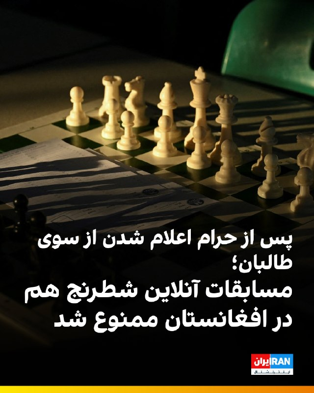

🔻عبدالخالق ویس، معاون فدراسیون شطرنج افغانستان، به افغانستان‌اینترنشنال گفت که طالبان یک سال پس از ممنوع و حرام اعلام کردن شطرنج و بستن فدراسیون و باشگاه‌های این ورزش، اکنون مسابقات آنلاین شطرنج را نیز ممنوع کرده‌اند.

🔹او گفت پیش از این، باشگاه‌های شطرنج در دو بخش حضوری و آنلاین فعالیت داشتند. پس از بسته شدن فدراسیون و باشگاه‌ها، تنها شمار محدودی از باشگاه‌ها برای زنده نگه داشتن این رشته، مسابقات آنلاین برگزار می‌کردند.

🔹به گفته او، طالبان در یکی دو روز گذشته مسئولان برگزارکننده مسابقات آنلاین شطرنج را به نهادهای امنیتی فراخوانده و سپس آنان را به اداره امر به معروف معرفی کرده‌اند.

🔹معاون فدراسیون شطرنج افغانستان گفت مسئولان این اداره با تهدید و فشار، از برگزارکنندگان تعهد گرفته‌اند که دیگر حق برگزاری مسابقات آنلاین شطرنج را ندارند.

🔹او تاکید کرد شطرنج یک بازی فکری است و هیچ تهدید یا خطری برای کسی ایجاد نمی‌کند و به همین دلیل، ممنوعیت این ورزش برای بسیاری شگفت‌انگیز و پرسش‌برانگیز است.

@iranintltvsport

## IranIntlTV — post 337283

کانال ۱۱ اسرائیل به نقل از منابع اسرائیلی و آمریکایی گزارش داد اسرائیل در پیامی روشن به واشینگتن، خواستار بازگشت به درگیری با جمهوری اسلامی شده است.

جزییات بیشتر در گزارش بابک اسحاقی، خبرنگار ایران‌اینترنشنال
@iranintltv

## IranIntlTV — post 337282

  

نت‌بلاکس خبر داد که قطعی اینترنت در ایران از هزار و ۸۲۴ ساعت گذشته و وارد هفتادوهفتمین روز شده است.
نت‌بلاکس نوشت: در پی تداوم قطع اینترنت در ایران، بخش زیادی از مردم از ارتباطات آنلاین و تعامل با جهان خارج محروم شده‌اند و نگرانی‌ها درباره پیامدهای روانی افزایش یافته است.
https://iranintl.com/202605150265

## IranIntlTV — post 337281

  <a href="telegram/content/IranIntlTV_337281_1778837427.mp4" target="_blank">🎬 Download video</a>

کانال ۱۱ اسرائیل به نقل از منابع اسرائیلی و آمریکایی گزارش داد اسرائیل در پیامی روشن به واشینگتن، خواستار بازگشت به درگیری با جمهوری اسلامی شده است.

جزییات بیشتر در گزارش بابک اسحاقی، خبرنگار ایران‌اینترنشنال
@iranintltv

## IranIntlTV — post 337280

  <a href="telegram/content/IranIntlTV_337280_1778837429.mp4" target="_blank">🎬 Download video</a>

یکی از مخاطبان ایران‌اینترنشنال که دانش‌آموز پایه دهم انسانی است می‌گوید با وجود نهایی نبودن امتحان‌های امسال، نگران سال آینده است، چون به گفته او کیفیت آموزش و شرایط یادگیری در سال جاری «افتضاح» بوده و دانش‌آموزان عملا چیزی یاد نگرفته‌اند. او می‌گوید در مدرسه غیردولتی تحصیل می‌کند.
این پیام با هوش مصنوعی خوانده شده است.

## IranIntlTV — post 337279

🗣روایت شما از زندگی در آتش‌بس- جمعه ۲۵ اردیبهشت ۱۴۰۵

🔹از مشهد پیام می‌دهم. واقعاً ما از این بلاتکلیفی خسته شدیم، گرانی بیداد می‌کند، دخل و خرج‌مان با هم همخوانی ندارد، باید ده نفر کار کنیم که یک نفر بتواند بخورد.

🔹یادم هست اینترنت غزه فقط چند روز قطع بود، کل دنیا و سازمان ملل گفتند جنایت جنگی است، علیه بشریت است و کلی فشار آوردند به اسرائیل و گفتند می‌خواهد حقایق جنگ در غزه را سرکوب کند. هی روزگار.

🔹یک عدد مرغ یک‌میلیون تومان شده است، ما چند ماه پیش با این رقم چهار عدد مرغ خریداری می‌کردیم، دیگر نمی‌دانم چه بگویم، باز ارزشی‌ها بروند بیرون شعار بدهند.

🔹از ملارد تهران، ما خیلی بدبختیم، به کی بگوییم آخه آب را روزی سه مرتبه قطع می‌کنند، بعدازظهرها از ساعت ۶ تا فردا ۶ صبح کلاً قطع می‌کنند، با این همه بارندگی باز می‌گویند آب کم است. با همه این قطعی‌ها قبض آب نجومی می‌آید.

🔹در مشهد، محله‌ی دلاوران. به هزار و یک بدبختی توانستیم وصل شویم، اینترنت نداریم، بنزین نداریم. از دوازده شب به بعد باید تو صف بنزین بایستی، شاید بنزین گیرت آمد، الان حتی بنزین پنج‌تومانی هم نمی‌دهند.

🔹من از تهران پیام می‌دهم، اوضاع واقعاً داغون است، شرکت‌ها همه تعطیل شدند و تعدیل نیرو می‌کنند، شرکت سیماران از ۶۰۰ پرسنل فقط ۵۰ نفر را نگه داشتند و بقیه را اخراج کردند.

## IranIntlTV — post 337278

  <a href="telegram/content/IranIntlTV_337278_1778837431.mp4" target="_blank">🎬 Download video</a>

🔻خبرگزاری مهر، وابسته به سازمان تبلیغات اسلامی در ویدیویی که از بدرقه تیم ملی در میدان انقلاب در بین طرفداران حکومت منتشر کرده، پرچم گروه حزب‌الله لبنان را سانسور کرده است. این سانسور با واکنش کاربران رسانه‌های اجتماعی روبه‌رو شده است‌.

@iranintltvsport

## IranIntlTV — post 337277

  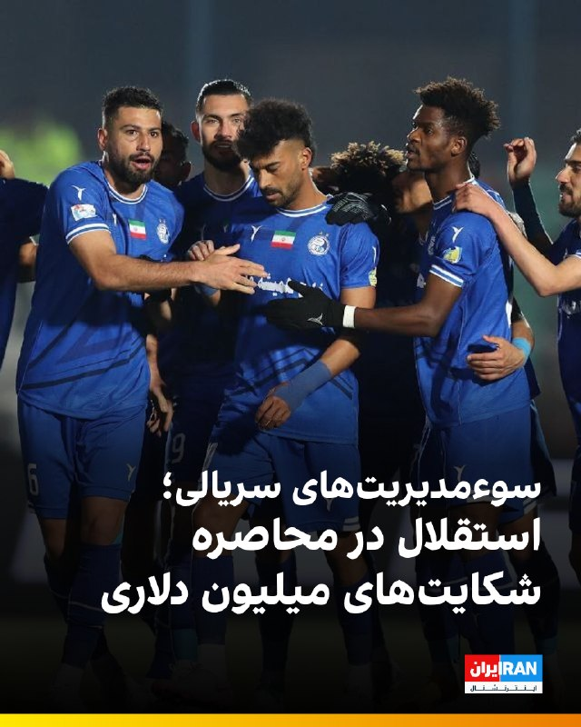

🔻ایسنا گزارش داده که انتشار جدیدترین صورت‌های مالی باشگاه استقلال در سامانه کدال، از بحران حقوقی این باشگاه خبر می‌دهد و نشان می‌دهد استقلال هم‌اکنون با ۶ پرونده حقوقی سنگین در فدراسیون جهانی فوتبال، فیفا و دیوان حکمیت ورزش (CAS) روبه‌رو است.

🔹در صورت محکومیت، بیش از ۳ میلیون و ۳۰۰ هزار دلار تعهد مالی به همراه یک ادعای ریالی ۲۸۸ میلیارد تومانی به این باشگاه تحمیل خواهد شد.

🔹اگرچه این پرونده‌ها هنوز به مرحله صدور رای قطعی نرسیده‌اند و بدهی قطعی محسوب نمی‌شوند، اما جزییات آن‌ها ابعاد سوءمدیریت‌های گذشته را آشکار می‌کند.

🔹بخش عمده این بحران مالی به دو بازیکن بوسنیایی مربوط می‌شود که در نقل‌وانتقالات تابستانی و در دوران مدیریت احمد شهریاری و فرشید سمیعی و سرمربی‌گری جواد نکونام به استقلال پیوستند.

🔹آلمدین زیلیکیچ پس از سه هفته حضور و بدون انجام حتی یک دقیقه بازی، قراردادش را فسخ کرد و اکنون شکایتی ۸۹۶ هزار دلاری ثبت کرده است.

🔹جزییات بیشتر را اینجا بخوانید

@iranintltvsport

## IranIntlTV — post 337276

  

یک پژوهشگر مسائل چین در گفت‌وگو با سی‌ان‌ان نشست دونالد ترامپ و شی جین‌پینگ را «۹.۹۹ از ۱۰» ارزیابی کرد و آن را رویدادی تاریخی توصیف کرد.

ویکتور گائو، مترجم پیشین انگلیسی دنگ شیائوپینگ، رییس‌جمهور پیشین چین، و استاد ممتاز دانشگاه سوچو، گفت: «بسیار موفق، با برنامه‌ریزی دقیق، اما در عین حال همراه با خودجوشی و هیجان فراوان.»

او افزود: «چین بهترین عملکرد خود را ارائه داد. مقام‌های دولتی آمریکا و همچنین رهبران تجاری نیز کار درست را انجام دادند. بنابراین این واقعا یک لحظه تاریخی است.»

گائو همچنین از اقدام دونالد ترامپ برای از سرگیری سفرهای ریاست‌جمهوری آمریکا به چین استقبال کرد و آن را «گامی مهم در مسیر درست» برای روابط دو کشور دانست. او یادآور شد روسای‌جمهوری آمریکا از زمان رونالد ریگان دست‌کم یک بار در دوره مسئولیت خود به چین سفر کرده بودند، اما جو بایدن، رییس‌جمهوری سابق آمریکا، در فاصله ژانویه ۲۰۲۱ تا ژانویه ۲۰۲۵ چنین سفری انجام نداد.

این پژوهشگر انتخاب معبد بهشت در پکن برای دیدار دو رهبر را نیز معنادار خواند و گفت در گذشته امپراتورها در آنجا برای برداشت خوب، صلح و ثبات دعا می‌کردند.
https://iranintl.com/2

## IranIntlTV — post 337275

  

دفتر رسانه‌ای دولت ابوظبی روز جمعه اعلام کرد امارات متحده عربی ساخت یک خط لوله جدید نفت را برای دو برابر کردن ظرفیت صادراتی خود از طریق فجیره تا سال ۲۰۲۷ تسریع می‌کند؛ اقدامی که توان این کشور برای دور زدن تنگه هرمز را به طور چشمگیری افزایش می‌دهد.

بر اساس اعلام این دفتر، شیخ خالد بن محمد بن زاید، ولیعهد ابوظبی، در نشست کمیته اجرایی به شرکت ملی نفت ابوظبی، ادنوک، دستور داد پروژه خط لوله غرب-شرق را با سرعت بیشتری پیش ببرد. این دفتر افزود این خط لوله در حال ساخت است و انتظار می‌رود در سال ۲۰۲۷ آغاز به کار کند. در این گزارش به جدول زمانی اولیه اجرای پروژه اشاره‌ای نشده است.

خط لوله موجود نفت خام ابوظبی که با نام خط لوله حبشان-فجیره نیز شناخته می‌شود، توان انتقال روزانه تا ۱.۸ میلیون بشکه نفت را دارد و در شرایطی که این کشور در پی افزایش صادرات مستقیم از سواحل خلیج عمان است، نقشی حیاتی ایفا کرده است.
https://iranintl.com/202605157635

## IranIntlTV — post 337274

  

کانال ۱۱ اسرائیل به نقل از منابع آمریکایی و اسرائیلی گزارش داد اورشلیم در «پیامی روشن» به واشینگتن اعلام کرده خواهان ازسرگیری کارزار نظامی علیه جمهوری اسلامی است. هدف این حملات، وادار کردن جمهوری اسلامی به بازگشت به میز مذاکره و عقب‌نشینی در پرونده هسته‌ای عنوان شده است.

بر اساس این گزارش، در رایزنی‌های اخیر گزینه انجام حملات محدود و هدفمند آمریکا علیه تاسیسات سوخت و انرژی در ایران مطرح شده است.

کانال ۱۱ افزود اسرائیل برای چنین سناریویی در حال آماده‌سازی است؛ از جمله آمادگی برای واکنش احتمالی جمهوری اسلامی و ازسرگیری حملات موشکی به سوی اسرائیل.
https://iranintl.com/202605155749

## IranIntlTV — post 337273

  <a href="telegram/content/IranIntlTV_337273_1778837436.mp4" target="_blank">🎬 Download video</a>

دونالد ترامپ گفت شی جین‌پینگ در مورد جمهوری اسلامی با او هم‌نظر است و معتقد است تهران هرگز نباید به سلاح هسته‌ای دست یابد. از سوی دیگر، وزارت خارجه چین، خواستار راه‌حلی فوری برای پایان دادن به جنگ با جمهوری اسلامی شده است.

توماج طاهباز، خبرنگار ایران‌اینترنشنال، گزارش می‌دهد
@iranintltv

## IranIntlTV — post 337272

  <a href="telegram/content/IranIntlTV_337272_1778837438.mp4" target="_blank">🎬 Download video</a>

یک شهروند با ارسال پیامی به ایران اینترنشنال با مقایسه قطع اینترنت در ایران و غزه گفت که در مورد غزه مواضع جهانی دیده شد. پیام این مخاطب با هوش مصنوعی خوانده شده است.

## IranIntlTV — post 337271

  

دونالد ترامپ، رییس‌جمهوری آمریکا، روز جمعه پس از سفری دو روزه سوار هواپیمای اختصاصی ریاست‌جمهوری آمریکا «ایر فورس وان» شد و پکن را ترک کرد. وانگ یی، وزیر امور خارجه چین، ترامپ را پیش از سوار شدن به هواپیما همراه با هیاتی دیپلماتیک بدرقه کرد.

شی جین‌پینگ، رییس‌جمهوری چین، در سخنرانی خود در مراسم ضیافت رسمی به مناسبت سفر دونالد ترامپ، این سفر را «تاریخی» خواند و گفت: «دو شعار "احیای چین" و "عظمت را به آمریکا بازگردانیم" می‌توانند در کنار یکدیگر پیش بروند.»
https://iranintl.com/202605150729

## IranIntlTV — post 337270

  <a href="telegram/content/IranIntlTV_337270_1778837441.mp4" target="_blank">🎬 Download video</a>

عباس عراقچی، وزیر خارجه جمهوری اسلامی، در دومین روز نشست وزیران خارجه کشورهای عضو بریکس، خواستار اصلاح ساختار سازمان ملل و «نمایندگی عادلانه» همه مناطق جهان در شورای امنیت شد.

جواد همدانی، خبرنگار ایران‌اینترنشنال، گزارش می‌دهد
@iranintltv

## IranIntlTV — post 337269

یک دانش‌آموز با ارسال پیامی به ایران اینترنشنال با روایت تاثیرات روحی کشتار معترضان در دی‌ماه و حمله به جمهوری اسلامی پس از آن می‌گوید وقتی صدای بمباران و انفجار نمی‌شنیدیم ناراحت می‌شدیم. صدای او با هوش مصنوعی تغییر یافته است.

## Shin_Persian — post 6008

  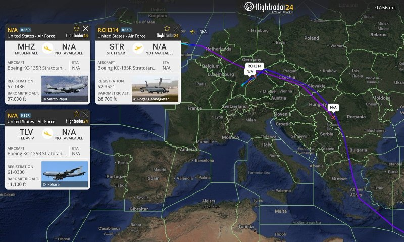

DefenceGeek 🇬🇧 ✓ @DefenceGeek Fri, 15 May 2026 08:02:32 UTC The Tanker Shuffle Continues #FreeIran‌ --- Operation EPIC FURY / Project FREEDOM --- As has been the case on most days during the ceasefire, the US tanker fleet (numbering over 220 aircraft)…

## Shin_Persian — post 6007

DefenceGeek 🇬🇧 ✓ @DefenceGeek
Fri, 15 May 2026 08:02:32 UTC

The Tanker Shuffle Continues #FreeIran‌
--- Operation EPIC FURY / Project FREEDOM ---

As has been the case on most days during the ceasefire, the US tanker fleet (numbering over 220 aircraft) across Europe and CENTCOM continues to shuffle around, with harder worked airframes being rotated out and replaced. So far today:

KC-135R "RCH736" 57-1486 #AE041D (EGUN -> LLBG)
KC-135R "?" 61-0300 #AE0689 (LLBG -> EDDS)
KC-135R "RCH314" 62-3521 #AE0485 (LFOA -> EDDS -> ?)
KC-135T "RCH559" 59-1471 #AE07A5 (CONUS -> EDDS)

@MATA_osint

فارسی

جابه‌جایی تانکرهای سوخت‌رسان ادامه دارد #FreeIran‌
--- عملیات خشم حماسی (Operation EPIC FURY) / پروژه آزادی (Project FREEDOM) ---

همانطور که در اکثر روزهای آتش‌بس صادق بوده است، ناوگان تانکرهای ایالات متحده (با بیش از ۲۲۰ هواپیما) در سراسر اروپا و سنتکام (ستاد فرماندهی مرکزی ایالات متحده - CENTCOM) به جابه‌جایی‌های خود ادامه می‌دهند و بدنه‌های پروازی که فشار کاری بیشتری داشته‌اند، از چرخه خارج و جایگزین می‌شوند. موارد ثبت شده تا این لحظه از امروز:

KC-135R "RCH736" 57-1486 #AE041D (فرودگاه ای‌جی‌یو‌ان -> فرودگاه بن گوریون)
KC-135R "?" 61-0300 #AE0689 (فرودگاه بن گوریون -> فرودگاه اشتوتگارت)
KC-135R "RCH314" 62-3521 #AE0485 (پایگاه هوایی اورو -> فرودگاه اشتوتگارت -> ?)
KC-135T "RCH559" 59-1471 #AE07A5 (ایالات متحده -> فرودگاه اشتوتگارت)

@MATA_osint

𝕏 · @shin_persian

## Shin_Persian — post 6006

  

NetBlocks ✓ @netblocks
Fri, 15 May 2026 07:37:19 UTC

🌍 #Iran's digital isolation is now entering its 77th day as the internet blackout passes 1824 hours. The measure presents an emerging mental health risk to the public, who are largely cut off from online platforms, communications, and normal interaction with the outside world.

فارسی

🌍 انزوای دیجیتال #ایران اکنون در حالی وارد هفتاد و هفتمین روز خود می‌شود که خاموشی اینترنت از ۱۸۲۴ ساعت فراتر رفته است. این اقدام ریسک نوظهوری را برای سلامت روان مردمی که تا حد زیادی از پلتفرم‌های آنلاین، ارتباطات و تعامل عادی با دنیای خارج محروم شده‌اند، ایجاد می‌کند.

𝕏 · @shin_persian

## ManotoTV — post 105478

  <a href="telegram/content/ManotoTV_105478_1778837444.mp4" target="_blank">🎬 Download video</a>

نارندرا مودی، نخست‌وزیر هند، روز جمعه ۲۵ اردیبهشت در جریان سفر به ابوظبی، با انتشار پیامی در شبکه اجتماعی ایکس نوشت: «دوستی میان هند و امارات بسیار نیرومند است.»

مودی در این سفر با شیخ محمد بن زاید، رئیس امارات متحده عربی، دیدار کرد. محور گفتگوهای دو طرف، گسترش روابط دوجانبه، همکاری‌های انرژی، همکاری‌های دفاعی و تحولات منطقه‌ای اعلام شده است.

این سفر در شرایطی انجام می‌شود که تنش‌های منطقه‌ای و نگرانی‌ها درباره امنیت مسیرهای انرژی، اهمیت همکاری میان هند و امارات را افزایش داده است. امارات یکی از شرکای مهم هند در حوزه انرژی و تجارت به شمار می‌رود و ابوظبی و دهلی نو در سال‌های اخیر روابط اقتصادی و راهبردی خود را گسترش داده‌اند.

## ManotoTV — post 105477

  <a href="telegram/content/ManotoTV_105477_1778837444.mp4" target="_blank">🎬 Download video</a>

عباس عراقچی، وزیر خارجه جمهوری اسلامی، در گفتگو با رسانه دولتی هند گفت «هیچ راه‌حل نظامی‌ای وجود ندارد» و افزود ایالات متحده باید این واقعیت را درک کند.

او گفت آمریکا «دست‌کم دو بار» جمهوری اسلامی را آزموده و اکنون به این نتیجه رسیده است که «راه‌حل نظامی وجود ندارد».

عراقچی مهم‌ترین مشکل در روند کنونی را «پیام‌های متناقض» از سوی مقام‌های آمریکایی دانست و گفت این پیام‌ها از طریق اظهارنظرها، مصاحبه‌ها و مواضع مختلف دریافت می‌شود.

## ManotoTV — post 105476

  <a href="telegram/content/ManotoTV_105476_1778837445.mp4" target="_blank">🎬 Download video</a>

رسانه دولتی اسرائیل گزارش داد ایال زامیر، رئیس ستاد ارتش اسرائیل، در جریان جنگ با ایران به امارات متحده عربی سفر کرده است.
بر اساس این گزارش، او همراه با چند مقام نظامی اسرائیل با مقام‌های اماراتی، از جمله محمد بن زاید، رئیس امارات، دیدار کرده است. ارتش اسرائیل تاکنون واکنشی به این گزارش نشان نداده است.
این گزارش پس از آن منتشر می‌شود که بنیامین نتانیاهو نیز گفته بود در زمان جنگ به امارات سفر کرده؛ ادعایی که از سوی امارات رد شد. همچنین گزارش‌هایی درباره سفر رؤسای سازمان‌های اطلاعاتی و امنیتی اسرائیل به امارات در زمان جنگ منتشر شده است.
در همین حال، مقام‌های آمریکایی تأیید کرده‌اند اسرائیل یک سامانه پدافند موشکی را به همراه نیروهای نظامی برای راه‌اندازی آن به امارات منتقل کرده است.

## ManotoTV — post 105475

  <a href="telegram/content/ManotoTV_105475_1778837446.mp4" target="_blank">🎬 Download video</a>

دفتر رسانه‌ای دولت ابوظبی روز جمعه ۲۵ اردیبهشت اعلام کرد امارات متحده عربی ساخت یک خط لوله نفتی تازه را برای افزایش صادرات از مسیر فجیره تسریع می‌کند.

این پروژه قرار است تا سال ۲۰۲۷ ظرفیت صادرات نفت امارات از فجیره را دو برابر کند و توان این کشور برای دور زدن تنگه هرمز را افزایش دهد.

فجیره در ساحل دریای عمان قرار دارد و نفتکش‌ها از این مسیر می‌توانند بدون عبور از تنگه هرمز بارگیری کنند.

## ManotoTV — post 105474

  <a href="telegram/content/ManotoTV_105474_1778837446.mp4" target="_blank">🎬 Download video</a>

گروه ناظر اینترنتی نت‌بلاکس اعلام کرد قطعی اینترنت در ایران امروز وارد هفتادوهفتمین روز خود شده و از مرز ۱۸۲۴ ساعت گذشته است.
نت‌بلاکس هشدار داده ادامه این محدودیت‌ها می‌تواند به یک خطر فزاینده برای سلامت روان شهروندان تبدیل شود؛ شهروندانی که تا حد زیادی از پلتفرم‌های آنلاین، ارتباطات و تعامل عادی با جهان خارج محروم شده‌اند.

## ManotoTV — post 105473

  <a href="telegram/content/ManotoTV_105473_1778837447.mp4" target="_blank">🎬 Download video</a>

دونالد ترامپ، رئیس‌جمهوری آمریکا، پس از پایان سفر دو روزه خود به چین، روز جمعه پکن را ترک کرد.
ترامپ با هواپیمای اختصاصی ریاست‌جمهوری آمریکا «ایر فورس وان» از چین خارج شد و وانگ یی، وزیر امور خارجه چین، به همراه هیاتی دیپلماتیک او را بدرقه کرد.

## ManotoTV — post 105472

  <a href="telegram/content/ManotoTV_105472_1778837448.mp4" target="_blank">🎬 Download video</a>

اف‌بی‌آی اعلام کرد برای دریافت اطلاعاتی که به شناسایی و بازداشت «مونیکا ویت»، مامور سابق ضدجاسوسی و متخصص اطلاعاتی نیروی هوایی آمریکا، منجر شود ۲۰۰ هزار دلار جایزه تعیین کرده است.
بر اساس بیانیه اف‌بی‌آی، ویت بین سال‌های ۱۹۹۷ تا ۲۰۰۸ در نیروی هوایی آمریکا خدمت کرده و سپس تا سال ۲۰۱۰ به‌عنوان پیمانکار دولت آمریکا فعالیت داشته است. او به اطلاعات محرمانه و فوق‌محرمانه، از جمله هویت نیروهای مخفی جامعه اطلاعاتی آمریکا، دسترسی داشته است. مقام‌های آمریکایی می‌گویند او پس از شرکت در نشست‌هایی مرتبط با برنامه «افق نو» در تهران، به ایران پناهنده شد و اطلاعات حساسی را در اختیار جمهوری اسلامی قرار داد.
وزارت دادگستری آمریکا پیش‌تر او را به همکاری در عملیات جاسوسی سایبری، افشای اطلاعات محرمانه و به خطر انداختن جان نیروهای آمریکایی و خانواده‌هایشان متهم کرده بود. اف‌بی‌آی می‌گوید مونیکا ویت همچنان متواری است و احتمال می‌دهد افرادی از محل اختفای او اطلاع داشته باشند.

## ManotoTV — post 105471

  <a href="telegram/content/ManotoTV_105471_1778837449.mp4" target="_blank">🎬 Download video</a>

ارتش اسرائیل اعلام کرد در پی فعال شدن آژیر هشدار در مناطق مسد و عیلابون، یک پرتابه شلیک‌شده از خاک لبنان به سوی اسرائیل رهگیری شده است. به گفته ارتش اسرائیل، این اقدام «نقض دیگری از تفاهم‌های آتش‌بس» از سوی حزب‌الله به شمار می‌رود.
همزمان ارتش اسرائیل اعلام کرد یک سرباز این کشور شب گذشته بر اثر شلیک خمپاره حزب‌الله در جنوب لبنان کشته شده است. سرباز کشته‌شده، گروهبان دوم نگو داگان، ۲۰ ساله، از گردان دوازدهم تیپ گولانی و اهل شهرک دکل در جنوب اسرائیل معرفی شده است.
ارتش اسرائیل همچنین اعلام کرد شب گذشته سکوی پرتابی را که حزب‌الله از آن چندین راکت به سوی منطقه کریات شمونا شلیک کرده بود، در منطقه زبدین در جنوب لبنان هدف قرار داده و منهدم کرده است. به گفته ارتش، چندین ساختمان مورد استفاده حزب‌الله برای اهداف نظامی نیز در این حملات هدف قرار گرفته‌اند.

## ManotoTV — post 105470

  <a href="telegram/content/ManotoTV_105470_1778837450.mp4" target="_blank">🎬 Download video</a>

ویدئویی از قدم زدن دونالد ترامپ و شی جین‌پینگ در باغ‌های مجموعه حکومتی ژونگ‌نان‌های در پکن منتشر شده است.
در این ویدئو، ترامپ از رئیس‌جمهوری چین می‌پرسد: «وقتی دیگر رؤسای کشورها به دیدارتان می‌آیند، آن‌ها را هم اینجا می‌پذیرید؟»
شی جین‌پینگ در پاسخ می‌گوید: «به ندرت می‌آیند».

## ManotoTV — post 105469

  <a href="telegram/content/ManotoTV_105469_1778837452.mp4" target="_blank">🎬 Download video</a>

دونالد ترامپ پس از دیدار با شی جین‌پینگ اعلام کرد آمریکا و چین درباره ایران دیدگاه‌های «بسیار مشابهی» دارند و هر دو خواهان پایان تنش‌ها و باز ماندن تنگه هرمز هستند.
ترامپ گفت: «نمی‌خواهیم ایران به سلاح هسته‌ای دست پیدا کند.» او همچنین وضعیت کنونی را «دیوانه‌وار» توصیف کرد و افزود واشینگتن خواهان پایان بحران است.
رئیس‌جمهوری آمریکا همچنین با اشاره به روابط خود با شی جین‌پینگ گفت دو طرف طی سال‌های گذشته توانسته‌اند مشکلاتی را حل کنند که دیگران قادر به حل آن‌ها نبودند و تاکید کرد روابط میان واشینگتن و پکن همچنان «بسیار قوی» است.

## ManotoTV — post 105468

  <a href="telegram/content/ManotoTV_105468_1778837453.mp4" target="_blank">🎬 Download video</a>

مقام‌های فنلاند روز جمعه درباره فعالیت مشکوک پهپادی در منطقه پایتخت هشدار دادند و فرودگاه هلسینکی اعلام کرد پروازها به‌طور موقت متوقف شده است.
پتری اورپو، نخست‌وزیر فنلاند، در پیامی در شبکه اجتماعی ایکس اعلام کرد: «مقام‌ها در حال اقدام هستند. نیروهای مسلح نیز توان نظارتی و واکنش خود را تقویت کرده‌اند. از همه می‌خواهم اطلاعیه‌های رسمی را دنبال کنند.

## FarsiVOA — post 217807

🔺مهم‌ترین دستاوردهای سفر ترامپ به چین چه بود؟

▪️دونالد ترامپ، رئیس‌جمهور آمریکا، که پس از یک سفر سه‌روزه، پکن را به مقصد واشنگتن ترک کرد، از پیشرفت‌های تجاری میان دو کشور خبر داده است.

▪️او روز جمعه گفت که درباره ایران هم با رئیس‌جمهور چین، گفت‌وگو کرده و هر دو رهبر درباره عدم دستیابی تهران به سلاح هسته‌ای و باز بودن تنگه‌ها نظر مشابهی دارند.

▪️ترامپ روز پنج‌شنبه نیز گفت شی توافق کرده سفارش ۲۰۰ فروند هواپیمای بوئینگ را نهایی کند.

▪️کاخ سفید اعلام کرده که رهبران آمریکا و چین درباره راه‌های تقویت همکاری اقتصادی میان دو کشور، از جمله گسترش دسترسی شرکت‌های آمریکایی به بازار چین و افزایش سرمایه‌گذاری چین در صنایع ایالات متحده، تبادل نظر کردند.

⬇️ بیشتر بخوانید:
https://ir.voanews.com/a/8150368.html

## FarsiVOA — post 217806

  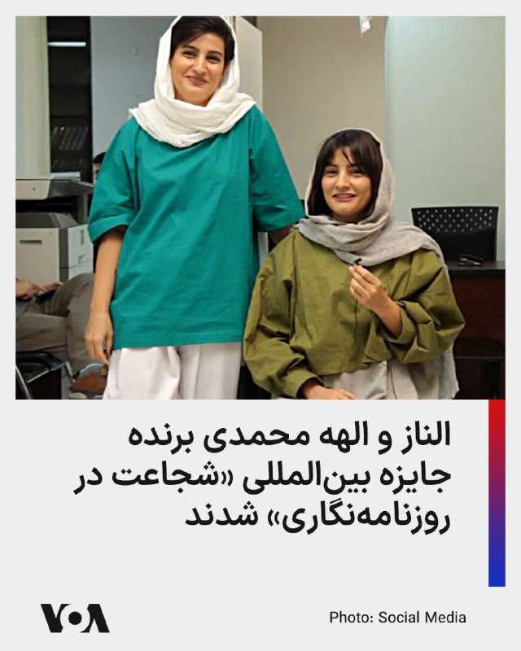

بنیاد بین‌المللی زنان رسانه، الناز و الهه محمدی، دو روزنامه‌نگار ایرانی را به عنوان برندگان جایزه شجاعت در روزنامه ‌نگاری سال ۲۰۲۶ اعلام کرد.

این بنیاد در بیانیه‌ای اعلام کرد که خواهران محمدی به همراه جورجیا فورت، روزنامه‌‌نگار آمریکایی و نای مین، نی (نام مستعار) روزنامه‌نگار اهل میانمار، «به ‌دلیل افشای حقیقت در شرایط خطرناک» برنده این جایزه مهم شدند.

الهه محمدی خبرنگاری است که با انتشار گزارش‌های اختصاصی از مراسم خاکسپاری مهسا امینی، به همراه نیلوفر حامدی در سال ۱۴۰۱ به دلیل این افشاگری‌ها مدتی از سوی عوامل امنیتی جمهوری اسلامی بازداشت شد.

الناز محمدی، بر اساس اعلام بنیاد بین‌المللی زنان رسانه، گزارش‌های متعددی درباره حقوق بشر، حقوق زنان و مسائل اجتماعی، منتشر کرده است. سازمان گزارشگران بدون مرز نیز اعلام کرده که الناز محمدی در فهرست نامزدهای جایزه «شجاعت» این نهاد برای سال ۲۰۲۶ قرار دارد.
@FarsiVOA

## FarsiVOA — post 217805

🔺ترامپ پکن را به مقصد واشنگتن ترک کرد

▪️دونالد ترامپ، رئیس‌جمهور آمریکا روز جمعه با پایان دادن به سفر سه‌روزه خود به چین، سوار بر هواپیمای ایر فورس وان شد و پکن را به مقصد واشنگتن ترک کرد.

▪️سفر سه‌روزه ترامپ به چین شامل یک ضیافت رسمی دولتی، بازدید از مکان‌های تاریخی، صرف چای دوجانبه و یک ناهار کاری بود.

▪️دو روز گفت‌وگو میان رئیس‌جمهور آمریکا و رهبر چین تاکنون به توافق‌هایی منجر شده و مقام‌ها اشاره کرده‌اند که ممکن است توافق‌های بیشتری در ادامه حاصل شود.

▪️رئیس‌جمهور آمریکا روز جمعه اعلام کرد که او درباره ایران با شی گفت‌وگو کرده و هر دو رهبر درباره عدم دستیابی تهران به سلاح هسته‌ای و باز بودن تنگه‌ها نظر مشابهی دارند.

⬇️ بیشتر بخوانید:
https://ir.voanews.com/a/8150366.html

## FarsiVOA — post 217804

  

ارتش اسرائیل با صدور اطلاعیه‌ای به ساکنان مناطق شبریحا، حمادیه (صور)، زقوق المفدی، معشوق، الحوش، در لبنان هشدار داد تا برای حفظ امنیت، فوراً خانه‌های خود را تخلیه کنند.

این هشدار در پی نقض توافق آتش‌بس از سوی «حزب‌الله» صادر شد و ارتش اسرائیل اعلام کرد که ناچار است با قدرت علیه این امر اقدام کند.

در اطلاعیه ارتش اسرائيل آمده است که شهروندان دست‌کم تا فاصله ۱۰۰۰ متری از این مناطق دور شده و به مناطق باز و امن پناه ببرند. هر کسی که در نزدیکی نیروهای حزب‌الله، تأسیسات و تجهیزات نظامی آن حضور داشته باشد، جان خود را در معرض خطر قرار می‌دهد.

شامگاه پنجشنبه ۲۴ اردیبهشت، «گروهبان نقب داگان»، ۲۰ ساله، سرباز ارتش اسرائیل بر اثر خمپاره‌ای حزب‌الله در جنوب لبنان کشته شد.
@FarsiVOA

## DW_Farsi — post 124718

  

🔶 پاداش اف‌بی‌آی برای یافتن مامور آمریکایی متهم به جاسوسی برای ایران

دفتر میدانی اف‌بی‌آی در واشنگتن اعلام کرد برای اطلاعاتی که به دستگیری و پیگرد قضایی مونیکا ویت، عضو سابق نیروهای نظامی ایالات متحده آمریکا و مامور ضدجاسوسی، منجر شود، ۲۰۰ هزار دلار جایزه تعیین کرده است.

او در فوریه ۲۰۱۹ از سوی هیئت منصفه فدرال در ناحیه کلمبیا به اتهام جاسوسی، از جمله انتقال اطلاعات دفاع ملی به جمهوری اسلامی متهم شده بود.

ویت، متخصص سابق اطلاعاتی نیروی هوایی ایالات متحده آمریکا در دوره خدمت فعال و مامور ویژه سابق دفتر تحقیقات ویژه نیروی هوایی، بین سال‌های ۱۹۹۷ تا ۲۰۰۸ در ارتش خدمت کرد و سپس تا سال ۲۰۱۰ به عنوان پیمانکار دولت ایالات متحده آمریکا فعالیت داشت. خدمت نظامی و فعالیت قراردادی او دسترسی به اطلاعات محرمانه و فوق محرمانه مرتبط با اطلاعات خارجی و ضدجاسوسی، از جمله نام‌های واقعی نیروهای مخفی جامعه اطلاعاتی ایالات متحده آمریکا، را برای او فراهم کرده بود.

ویت در سال ۲۰۱۳ به ایران گریخت. بر اساس کیفرخواست، او پس از آن اطلاعاتی را در اختیار حکومت ایران قرار داد و اطلاعات و برنامه‌های حساس و طبقه‌بندی‌شده دفاع ملی ایالات متحده آمریکا را در معرض خطر قرار داد.

بر اساس اعلام اف‌بی‌آی، ویت عمدا اطلاعاتی را ارائه کرده که جان نیروهای آمریکایی و خانواده‌های آن‌ها را که در خارج از کشور مستقر بودند، به خطر انداخته است. همچنین گفته می‌شود او از طرف حکومت ایران تحقیقاتی انجام داده تا آن‌ها بتوانند همکاران سابق او در دولت ایالات متحده آمریکا را هدف قرار دهند.

به گفته اف‌بی‌آی، فرار ویت به ایران برای سپاه پاسداران انقلاب اسلامی سودمند بوده است. در بیانیه اف‌بی‌آی آمده است که سپاه دارای بخش‌هایی است که مسئول جمع‌آوری اطلاعات، جنگ نامتقارن و ارائه پشتیبانی مستقیم به چند سازمان تروریستی هستند که شهروندان و منافع ایالات متحده آمریکا را هدف قرار می‌دهند.

اگرچه برای جرایم ادعایی ویت، کیفرخواست صادر شده، اما او همچنان متواری است. اف‌بی‌آی می‌گوید همچنان فعالانه برای یافتن ویت و "کشاندن او به پای میز عدالت" تلاش می‌کند.

در همین راستا دنیل ویرزبیتسکی، مامور ویژه مسئول بخش ضدجاسوسی و سایبری دفتر میدانی اف‌بی‌آی در واشنگتن، اعلام کرد: «گفته می‌شود مونیکا ویت بیش از یک دهه پیش با فرار به ایران و ارائه اطلاعات دفاع ملی به حکومت ایران، سوگند خود به قانون اساسی را نقض کرده و احتمالا همچنان به فعالیت‌های مخرب آن‌ها کمک می‌کند.»

او افزود: «اف‌بی‌آی این موضوع را فراموش نکرده و معتقد است در این مقطع مهم از تاریخ ایران، فردی وجود دارد که چیزی درباره محل اختفای او می‌داند. اف‌بی‌آی می‌خواهد از شما بشنود تا بتوانید به ما برای دستگیری ویت و کشاندن او به پای میز عدالت کمک کنید.»

@dw_farsi

## DW_Farsi — post 124717

  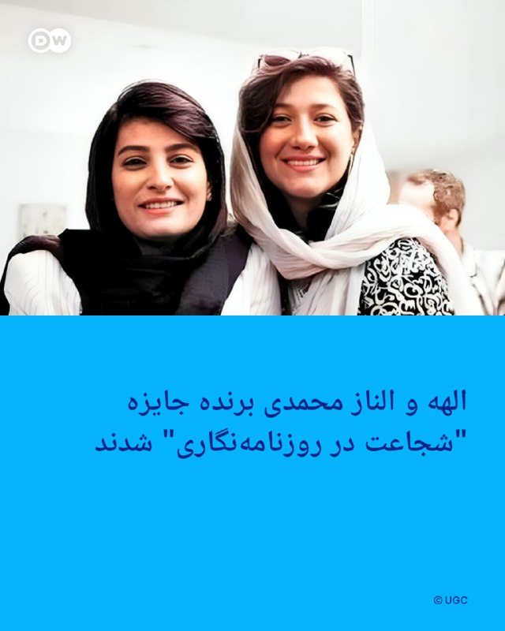

🔶 الهه و الناز محمدی برنده جایزه "شجاعت در روزنامه‌نگاری" شدند

بنیاد بین‌المللی رسانه زنان (IWMF) برنگان سی‌وهفتمین دوره سالانه جوایز "شجاعت در روزنامه‌نگاری" را معرفی کرد.

این جایزه از زنانی تقدیر می‌کند که تحت شرایط خطرناک و فشار شدید برای آشکار کردن حقیقت گزارش تهیه می‌کنند.

برندگان سال ۲۰۲۶ شامل الهه و الناز محمدی، خواهران ایرانی و خبرنگاران رسانه‌های چاپی؛ جورجیا فورت، خبرنگار تلویزیونی از ایالات متحده آمریکا؛ و نای مین نی (با استفاده از نام مستعار)، خبرنگار دیجیتال از میانمار هستند.

فرنچی می کامپیو، خبرنگار فیلیپینی که درباره خشونت حکومتی در فیلیپین گزارش تهیه می‌کند و اکنون در همان کشور زندانی است، جایزه "والیس آننبرگ برای عدالت برای زنان روزنامه‌نگار" بنیاد بین‌المللی رسانه زنان در سال ۲۰۲۶ را دریافت کرد؛ این جایزه‌ که هر سال به روزنامه‌نگاری اعطا می‌شود که به ناحق بازداشت، زندانی یا محبوس شده باشد.

برندگان جایزه شجاعت امسال از میان نامزدهایی از ۵۳ ملیت انتخاب شدند. به گفته ناظران، این امر نشان‌دهنده کاهش آزادی مطبوعات در جهان است و با ترکیبی از فشارهای حقوقی، ارعاب جنسیتی و هدف‌گیری دیجیتال تشدید شده است.

الیزا لیس مونوز، رئیس بنیاد بین‌المللی رسانه زنان با اشاره به برندگان جوایز امسال شجاعت در روزنامه‌نگاری گفت: «جرم‌انگاری حقیقت‌گویی همان چیزی است که شجاعت را به آینده روزنامه‌نگاری تبدیل می‌کند. برای زنانی که جرات گزارشگری دارند، خود روزنامه‌نگاری در حال بازتعریف شدن به‌عنوان عملی قابل مجازات است.»

او افزود: «ما دیگر در جهانی از سرکوب واکنشی زندگی نمی‌کنیم، بلکه در جهانی از بازدارندگی پیش‌دستانه هستیم؛ جایی که خودِ گزارشگری به یک مسئولیت خطرناک تبدیل شده است. بنیاد بین‌المللی رسانه زنان با افتخار از الهه، الناز، فرنچی، جورجیا و نای، زنانی که با همان خطری زندگی می‌کنند که درباره آن گزارش تهیه می‌کنند، امسال با جوایز شجاعت تقدیر می‌کند.»

@dw_farsi

## DW_Farsi — post 124716

  

📸 عکس روز: شنا در رود راین

گرچه در بسیاری از مناطق شنا کردن در رود راین خطرناک و به همین دلیل ممنوع است، اما بنا به یک سنت ۵۰ ساله در شهر کلن، امسال ۱۰۰ زن و مرد تن به آب زدند. این شنا در روز معراج عیسی مسیح که در آلمان روز پدر نیز هست هر ساله برگزار می‌شود. شرایط شنا در رود راین در کلن برای همه شناگران یکسان است: یک ساعت در آب، عبور از زیر چهار پل، و خروج دوباره از رود راین.

@dw_farsi

## DW_Farsi — post 124715

  

🔶 فرمانده سنتکام: توان تهاجمی ایران محدود شده، اما کاملا از بین نرفته

برد کوپر، فرماندهی منطقه‌ای ایالات متحده آمریکا (سنتکام)، گزارش‌های منتشرشده در خصوص سالم ماندن بخشی از مواضع موشکی جمهوری اسلامی را رد کرد.

کوپر، فرمانده سنتکام، در جلسه‌ای در کنگره آمریکا گفت ارقامی که در حال انتشار هستند، از نگاه او نادرست‌اند. او همچنین گفت در ارزیابی توان تهاجمی ایران، موضوع اصلی بیشتر بحث ساختارهای فرماندهی و کنترل است که نابود شده‌اند. کوپر اذعان کرد توانایی‌های ایران برای مسدود کردن تنگه هرمز تضعیف شده، اما از بین نرفته است.

پیش از این، روزنامه نیویورک تایمز گزارش داده بود که زرادخانه موشکی ایران در مقایسه با ادعای دولت آمریکا در این زمینه، در وضعیت بسیار بهتری قرار دارد.

فرمانده سنتکام در این جلسه همچنین به اقدامات جمهوری اسلامی در تنگه هرمز  نیز اشاره کرد و گفت: «توانایی [حکومت ایران] به شکل قابل توجهی تضعیف شده است. اگر فقط از تجربه حرفه‌ای خودم استفاده کنم، در ۱۰۰ بار عبور از تنگه هرمز، معمولا ۲۰ تا ۴۰ قایق تندرو می‌دیدید؛ اما اخیرا فقط دو یا سه قایق دیده‌ایم..»

@dw_farsi

## Persian_Trend_Official — post 14180

💢رئیس ستاد کل ارتش اسرائیل در جریان جنگ ایران به طور مخفیانه به امارات متحده عربی سفر کرد و با شیخ محمد بن زاید دیدار کرد — که به فهرست فزاینده‌ای از مقامات ارشد اسرائیلی پیوست که سفرهای مخفیانه در زمان جنگ به ابوظبی داشتند.

💢امارات متحده عربی همچنان این دیدارها را انکار می‌کند.

🫆:Tony

📌 @persian_trend_official
پرشین ترند | متفاوت‌ترین کانال نظامی

## Persian_Trend_Official — post 14179

  <a href="telegram/content/Persian_Trend_Official_14179_1778837458.webm" target="_blank">🎬 Download video</a>

🔴 آمریکا برای اطلاعات درباره واحد تولید پهپاد سپاه جایزه تعیین کرد

💢وزارت خارجه آمریکا اعلام کرد برای دریافت اطلاعات درباره ۶ فرد مرتبط با واحد تولید پهپاد نیروی قدس سپاه پاسداران جایزه مالی تعیین کرده است.

بر اساس بیانیه واشینگتن:

▪️ این افراد با شرکت «کیمیا پارت سیوان» مرتبط هستند
▪️ آمریکا مدعی است این مجموعه در آزمایش، توسعه و تأمین پهپادها نقش دارد
▪️ اطلاعات درباره این افراد، همکاران یا شبکه‌های مالی آن‌ها می‌تواند مشمول جایزه شود

💢برنامه پاداش امنیتی وزارت خارجه آمریکا اعلام کرده میزان این جایزه تا ۱۵ میلیون دلار خواهد بود.

💢در متن منتشرشده آمده است:

▪️ «به ما کمک کنید به منابع مالی سپاه ضربه بزنیم»

🫆:Tony

📌 @persian_trend_official
پرشین ترند | متفاوت‌ترین کانال نظامی

## Persian_Trend_Official — post 14178

🔴 ترامپ پکن را ترک کرد؛ پایان سفر رئیس‌جمهور آمریکا به چین

💢دونالد ترامپ پس از پایان سفر خود به چین، سوار بر هواپیمای ریاست‌جمهوری آمریکا پکن را ترک کرد.

در مراسم بدرقه:

▪️ فرش قرمز برای رئیس‌جمهور آمریکا پهن شده بود
▪️ حاضران پرچم‌های آمریکا و چین را در دست داشتند
▪️ یک گروه موسیقی نظامی نیز در مراسم خداحافظی اجرا داشت

💢سفر ترامپ به چین با دیدارهای مهم با شی جین‌پینگ و گفت‌وگو درباره موضوعاتی از جمله ایران، تایوان، تجارت و تنگه هرمز همراه بود.

🫆:Tony

📌 @persian_trend_official
پرشین ترند | متفاوت‌ترین کانال نظامی

## Persian_Trend_Official — post 14177

🔴 ارتش اسرائیل مدعی انهدام پرتابگر راکتی حزب‌الله شد

💢ارتش اسرائیل اعلام کرد یک سکوی پرتاب راکت متعلق به حزب‌الله را که برای شلیک به شمال اسرائیل استفاده شده بود، هدف قرار داده و منهدم کرده است.

بر اساس ادعای ارتش اسرائیل:

▪️ این پرتابگر در منطقه «زبقین» در جنوب لبنان قرار داشته است
▪️ حمله پس از شلیک راکت‌ها به سمت شمال اسرائیل انجام شده
▪️ این موضع متعلق به نیروهای حزب‌الله بوده است

🫆:Tony

📌 @persian_trend_official
پرشین ترند | متفاوت‌ترین کانال نظامی

## Persian_Trend_Official — post 14176

  <a href="telegram/content/Persian_Trend_Official_14176_1778837459.webm" target="_blank">🎬 Download video</a>

🔴 چین خواستار مذاکره برای پایان جنگ ایران شد

💢وزارت خارجه چین اعلام کرد ثبات در خلیج فارس و خاورمیانه در شرایط کنونی مهم‌ترین مسئله است و ادامه جنگ ایران پیامدهای خطرناکی برای منطقه به‌دنبال دارد.

💢سخنگوی وزارت خارجه چین تأکید کرد:

▪️ باید هرچه سریع‌تر راهی برای پایان جنگ پیدا شود
▪️ فرصت آغاز مذاکرات و پایان درگیری‌ها نباید از دست برود
▪️ بازگشایی و حفظ تردد آزاد در تنگه هرمز ضروری است
▪️ گفت‌وگو و مذاکره تنها مسیر مناسب برای حل بحران محسوب می‌شود

💢پکن همچنین هشدار داد هرگونه اختلال در تنگه هرمز می‌تواند تبعات گسترده‌ای برای اقتصاد و امنیت جهانی داشته باشد.

🫆:Tony

📌 @persian_trend_official
پرشین ترند | متفاوت‌ترین کانال نظامی

## Persian_Trend_Official — post 14175

  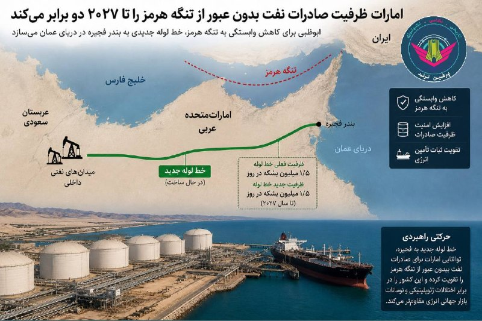

🔴 امارات ظرفیت صادرات نفت بدون عبور از تنگه هرمز را دو برابر می‌کند

💢امارات متحده عربی اعلام کرد تا سال ۲۰۲۷ ظرفیت صادرات نفت خام خود بدون نیاز به عبور از تنگه هرمز را دو برابر خواهد کرد.

بر اساس گزارش‌ها:

▪️ شرکت ملی نفت ابوظبی در حال ساخت خط لوله جدیدی به بندر فجیره در دریای عمان است
▪️ هدف این پروژه کاهش وابستگی به تنگه هرمز عنوان شده است
▪️ بسته‌شدن مسیر هرمز در جریان جنگ ایران، بازارهای جهانی را دچار بحران کرده است

💢امارات هم‌اکنون نیز یک خط لوله با ظرفیت روزانه ۱.۵ میلیون بشکه از میادین نفتی داخلی به بندر فجیره در اختیار دارد؛ مسیری که در جریان تنش‌های اخیر نقش حیاتی برای صادرات نفت این کشور ایفا کرده است.

🫆:Tony

📌 @persian_trend_official
پرشین ترند | متفاوت‌ترین کانال نظامی

## RadioFarda — post 157203

  

🔸امارات متحده عربی اعلام کرد این کشور ساخت یک خط لوله جدید نفتی را برای دو برابر کردن ظرفیت صادرات نفت از طریق بندر فجیره تا سال ۲۰۲۷ تسریع خواهد کرد. این اقدام توانایی ابوظبی برای دور زدن تنگه هرمز را به‌طور چشمگیری افزایش خواهد داد.

🔸دفتر رسانه‌ای دولت ابوظبی روز جمعه ۲۵ اردیبهشت اعلام کرد شیخ خالد بن محمد بن زاید، ولیعهد ابوظبی، به شرکت ملی نفت ابوظبی، ادنوک، دستور داده است اجرای پروژه خط لوله «غرب به شرق» را سرعت ببخشد. به‌گفتهٔ این نهاد، این خط لوله اکنون در حال ساخت است و انتظار می‌رود در سال ۲۰۲۷ به بهره‌برداری برسد.

🔸در بیانیهٔ دولت امارات اشاره‌ای به زمان‌بندی اولیه این پروژه نشده است.

🔸خط لولهٔ کنونی نفت خام ابوظبی، موسوم به «حبشان ـ فجیره»، ظرفیت انتقال روزانه تا یک میلیون و ۸۰۰ هزار بشکه نفت را دارد و نقش مهمی در افزایش صادرات مستقیم نفت امارات از سواحل دریای عمان ایفا کرده است.

@RadioFarda

## RadioFarda — post 157202

  <a href="telegram/content/RadioFarda_157202_1778837461.mp4" target="_blank">🎬 Download video</a>

🔸رئیس‌جمهور آمریکا، روز جمعه ۲۵ اردیبهشت گفت که در مورد ایران با شی جین‌پینگ، رئیس‌جمهور چین، گفت‌وگو کرده است و هر دو طرف هم‌نظر هستند که ایران نباید سلاح هسته‌ای داشته باشد و خواستار باز شدن تنگه‌ هرمز هستند.

🔸به گزارش رویترز، دونالد ترامپ ساعتی پیش از پایان سفر رسمی خود به چین گفت که صبر آمریکا درباره ایران رو به پایان است و تأکید کرد که تهران باید وارد توافق شود.

🔸بر اساس جمع‌بندی کاخ سفید از این دیدار، دو طرف بر ضرورت جلوگیری از نظامی‌سازی تنگه هرمز تأکید کرده‌اند.

🔸در مقابل، وزارت خارجه چین اعلام کرده که این کشور با ادامه جنگ ایران مخالف است و تأکید کرده این درگیری نباید هرگز آغاز می‌شد.

🔸ترامپ در گفت‌وگو با فاکس‌نیوز هم اعلام کرد که چین وعده داده از ارسال تجهیزات نظامی به ایران خودداری کند و در مقابل، پکن به دنبال افزایش خرید نفت از آمریکا برای کاهش وابستگی به مسیرهای انرژی منطقه‌ای است.

🔸در همین حال، تحلیلگران می‌گویند میزان همکاری واقعی چین در این پرونده همچنان محل تردید است؛ زیرا ایران برای پکن یک شریک مهم در حوزه انرژی و سیاست منطقه‌ای به شمار می‌رود.

@RadioFarda

## RadioFarda — post 157201

نمایشگاه مجازی کتاب تهران؛ دولت چه می‌کند، ناشران چه می‌گویند؟

🔸در حالی که صنعت نشر و بازار کتاب ایران زیر فشار بحران‌های اقتصادی، گرانی کاغذ، پیامدهای جنگ و سانسور دولتی همچنان برای بقا تلاش می‌کند، قرار است هفتمین دورهٔ نمایشگاه مجازی کتاب تهران هم در عین قطع اینترنت برگزار شود.

🔸نمایشگاه مجازی کتاب تهران با شعار «بخوانیم برای ایران» از روز ۲۶ اردیبهشت آغاز به کار می‌کند و تا دوم خرداد ادامه دارد.

🔸به‌گفتۀ مسئولان نمایشگاه، حدود ۲۲۹۶ ناشر داخلی ثبت‌نام کرده‌اند و مشخصات بیش از ۸۰ درصد کتاب‌ها در سامانهٔ نمایشگاه بارگذاری شده است.

🔸ابراهیم حیدری، مدیرعامل خانهٔ کتاب و ادبیات ایران و قائم‌مقام هفتمین نمایشگاه مجازی کتاب تهران، روز چهارشنبه ۲۳ اردیبهشت در نشست خبری این نمایشگاه اعلام کرد که در این دوره برای حمایت از خریداران، تمامی کتاب‌ها با ۱۵ درصد تخفیف عرضه می‌شوند و همچنین برای هر خریدار مبلغ ۱۰۰ هزار تومان بن خرید مجازی در نظر گرفته شده تا بخشی از هزینه‌های خرید کتاب کاهش یابد.

🔸نمایشگاه مجازی کتاب تهران که با پشتیبانی اینترانت یا همان اینترنت داخلی فعالیت می‌کند، در شرایط قطع اینترنت جهانی در ایران به بهانهٔ جنگ است که بیش از ۷۶ روز از آن می‌گذرد.

🔸این قطعی اخلال گسترده‌ای در کار ناشران ایرانی نیز پدید آورده است. به‌عنوان نمونه، امیر حسین‌زادگان، مدیر انتشارات ققنوس، یکی از ناشران بزرگ تهران، اعلام کرده که چند وقتی است این انتشارات «به حالت تعطیل» درآمده و به دلیل قطع اینترنت «ارتباط نشر با نویسندگان و مترجمان، چه در داخل و چه خارج از ایران، قطع شده است.»

🔸نسخه کامل این گزارش را در وب‌سایت رادیوفردا بخوانید.

@RadioFarda

## RadioFarda — post 157200

  

🔸یک نمایندهٔ مجلس شورای اسلامی می‌گوید واگذاری «اینترنت کسب‌وکارها» که به‌عنوان «اینترنت پرو» یا «طبقاتی» مشهور شده، مصوبهٔ شورای عالی امنیت ملی بوده و در اجرا به «قلکی برای همراه اول، ایرانسل و رایتل» تبدیل شده است.

🔸مصطفی پوردهقان، عضو کمیسیون صنایع و معادن مجلس، روز پنجشنبه ۲۴ اردیبهشت به باشگاه خبرنگاران جوان گفت مصوبهٔ شورای عالی امنیت ملی «که به اسم مصوبهٔ باز شدن اینترنت برای کسب‌وکارهای اینترنتی بود، در اجرا به قلکی برای همراه اول، ایرانسل و رایتل تبدیل شد تا بیایند با آن اینترنت بسازند، بعد هم خودشان یک اسم عجیب اختراع کنند و اسم اینترنت پرو را روی آن بگذارند.»

🔸حکومت ایران اینترنت را از نهم اسفند پارسال، روز شروع جنگ آمریکا و اسرائیل با ایران، قطع کرد و به‌رغم گذشت ۷۶ روز هنوز برای عموم مردم قطع است و اخیراً اپراتورها اقدام به ثبت‌نام و فروش گران‌قیمت اینترنت تحت عنوان «پرو» به برخی طبقات کرده‌اند که واکنش‌های گسترده‌ای در پی داشته است.

@RadioFarda

## RadioFarda — post 157199

  

🔸محمدعلی جعفری، فرمانده کل اسبق سپاه پاسداران انقلاب اسلامی، در مصاحبه‌ای با خبرگزاری تسنیم، وابسته به سپاه، با تأکید بر آن چه «شروط اصلی» ایران خوانده می‌شود گفت: «تا زمانی که جنگ در همه جبهه‌ها پایان نیافته، تحریم‌ها برداشته نشده، پول‌های بلوکه‌شده آزاد نشده، خسارت‌های ناشی از جنگ جبران نشده و حق حاکمیت ایران بر تنگه هرمز به رسمیت شناخته نشده باشد، هیچ مذاکره دیگری در کار نیست.»

🔸این روزها تابلوهایی تبلیغاتی در سراسر شهر تهران به چشم می‌خورد که در آنها از «پنج شرط اصلی ایران برای پایان جنگ» یاد شده است.

🔸آن چه جعفری بر آنها تأکید کرده همان شروطی است که در این تابلوها آمده است.

🔸به گفته این مقام سابق سپاه، از آنجا که ایران دو بار در میانه مذاکره با آمریکا هدف حمله قرار گرفته،‌ «ما کاملاً نسبت به دشمن بی‌اعتمادیم» و «بدعهدی‌ها و عهدشکنی‌هایی که دشمن با آغاز جنگ در میانه مذاکره مرتکب شده، باید برای او تاوان داشته باشد.»

🔸شرایط مورد اشاره این مقام سابق سپاه همان مفاد طرح تازه ایران است که در هفته گذشته به دست دولت آمریکا رسید و دونالد ترامپ آن را «احمقانه» و «غیر قابل قبول» خواند.

@RadioFarda

## IranianMinds — post 20172

🔴 عراقچی :

آمریکا با راه نظامی هرگز نمیتونه مارو شکست بده و به اهدافش برسه ، ولی اگه دیپلماسی رو امتحان میکرد شاید متفاوت بود

@IranianMinds

## IranianMinds — post 20171

  

🔴 نیویورک پست:

اف‌بی‌آی جایزه‌ای ۲۰۰ هزار دلاری برای دستگیری مونیکا ویت، مأمور سابق اطلاعات نیروی هوایی آمریکا که از سال ۲۰۱۹ متهم به جاسوسی برای ایران است، اعلام کرده است

@IranianMinds

## IranianMinds — post 20170

  <a href="https://t.me/IranianMinds/20170" target="_blank">📎 Download file</a>

📲#اپلیکیشن اندروید سایت جهانی دربی بت

👍اسپانسر لیگ انگلیس
👍
🔥امکان شارژ امن از طریق کارت بانکی
➖➖➖➖➖➖➖➖➖

🪙همین حالا عضو شوید 👇
https://t.me/+aCbq7yy8QY80NzQ0

## IranianMinds — post 20169

  

😤دنبال یه سایت شرط بندی بین المللی بودی که به ایرانیا خدمات بده؟!
⛔

👍دربی بت همون انتخاب  100%

💎ویژگی های سایت جهانی Derby Bet:

⬅️امکان شارژ امن با کارت بانکی

⬅️واریز اول دوبل شارژ می شوید(بونوس۱۰۰٪)

⬅️پر اپشن ترین سایت فعال در ایران

⬅️تسویه حساب کمتر از 5 دقیقه

⬅️برگشت بخشی از باخت به صورت هفتگی

🚨کد هدیه ثبت نام:GG007

⚠️برای دانلود اپلکیشن کلیک کنید
👉
re25

🔔کانال دربی بت :

🪙https://t.me/+aCbq7yy8QY80NzQ0

## IranianMinds — post 20168

🔴 ترامپ :

نابودی نظامی ایران ادامه خواهد داشت

@IranianMinds

## IranianMinds — post 20167

🔴 ترامپ به فاکس‌ نیوز :

من از الان دیگه آدم صبوری نیستم و صبر بیشتری به ایران نشان نخواهم داد!

@IranianMinds

## IranianMinds — post 20166

  

🔴 ترامپ :

من و رئیس جمهور چین درباره ایران صحبت کردیم. احساساتمان بسیار شبیه هم است. ما می‌خواهیم تنگه‌ هرمز باز باشد و هدف ما یکیه.

@IranianMinds

## IranianMinds — post 20165

  <a href="telegram/content/IranianMinds_20165_1778837467.mp4" target="_blank">🎬 Download video</a>

🔴 نتانیاهو:

امروز، ۶۰٪ از نوار غزه تحت کنترل ماست. ولی فردا باید ببینیم…

@IranianMinds

## IranianMinds — post 20164

  <a href="telegram/content/IranianMinds_20164_1778837470.mp4" target="_blank">🎬 Download video</a>

چه عظمتی داره هواپیماش

لحظه ی خروج هواپیمای ریاست جمهوری ایالات متحده از چین

@IranianMinds

## IranianMinds — post 20163

  

ترامپ چین رو‌‌ ترک‌ کرد

@IranianMinds

## BBCPersian — post 281120

🔻افزایش قیمت سوخت در هند در پی جهش قیمت جهانی نفت

شرکت‌های دولتی عرضه سوخت در هند برای نخستین بار در چهار سال اخیر قیمت‌ها را افزایش دادند .

جهش قیمت جهانی نفت پس از آغاز جنگ ایران و محدود شدن رفت‌وآمد در تنگه هرمز، باعث فشار بر ذخایر ارزی هند شده است.

هند، سومین واردکننده بزرگ نفت در جهان، از آخرین اقتصادهای بزرگ محسوب می‌شود که قیمت سوخت در جایگاه‌ها را افزایش می‌دهد.

این تصمیم باعث افزایش هزینه کالاهای روزمره برای صدها میلیون نفر خواهد شد.

این اقدام تنها چند روز پس از آن صورت می‌گیرد که نارندرا مودی، نخست‌وزیر هند، از مردم خواست که در مصرف سوخت صرفه‌جویی کنند.

https://bbc.in/3R12525
@BBCPersian

## BBCPersian — post 281119

🔻سفر ترامپ با تشریفات فراوان و دستاوردهای سیاسی اندک همراه بود

🖌لورا بیکر- بی‌بی‌سی

این سفر بیشتر بر تشریفات و نمایش‌های رسمی متمرکز بود، اما تا اینجا توافق‌های سیاسی بسیار کمی میان دو طرف حاصل شده است.

به نظر می‌رسد که جنگ ایران بر نشستی سایه انداخت که قرار بود محور اصلی آن تجارت باشد.

دونالد ترامپ مدعی شده است که شی جین‌پینگ متعهد شده از ارسال تجهیزات نظامی به ایران خودداری کند. وزارت خارجه چین هم بیانیه‌ای منتشر کرده که در آن آمده پکن «بی‌وقفه» برای کمک به پایان دادن به این درگیری تلاش کرده است.موضوعی که نشان می‌دهد مقامات چینی پشت‌پرده در حال تلاش هستند تا متحد خود ایران را به سمت میز مذاکره سوق دهند.

آقای ترامپ همچنین گفته است که چین در حال گفت‌وگو برای خرید ۲۰۰ فروند هواپیمای بوئینگ و حتی احتمالاً نفت آمریکا است.

انتظار می‌رود که اعلام شود که دو طرف همچنین توافق کرده‌اند آتش‌بس تجاری‌ای را که در اکتبر گذشته در بوسان حاصل شده بود، ادامه دهند.

شاید دستاورد واقعی این باشد که اصلاً این مذاکرات انجام شده است.

https://bbc.in/3R12525
@BBCPersian

## BBCPersian — post 281118

🔻ارتش اسرائیل برای پنج روستا در جنوب لبنان دستور تخلیه صادر کرد

ارتش اسرائیل روز جمعه از ساکنان پنج روستا در جنوب لبنان خواست تا فوراً این مناطق را تخلیه کنند. اقدامی که در آستانه حملات احتمالی علیه حزب‌الله و با وجود آتش‌بسی که برای توقف درگیری‌ها برقرار شده بود، انجام می‌شود.

آویخای ادرعی، سخنگوی عرب‌زبان ارتش اسرائیلدر شبکه اجتماعی ایکس اعلام کرد که «با توجه به نقض توافق آتش‌بس از سوی حزب‌الله، ارتش ناچار به اقدام قاطع علیه آن است» و نام پنج روستا در نزدیکی شهر صور در ساحل جنوبی لبنان را منتشر کرد.

او همچنین هشدار داد: «برای حفظ جان خود، فوراً خانه‌هایتان را تخلیه کنید و حداقل هزار متر از این مناطق فاصله بگیرید.»

https://bbc.in/3R12525
@BBCPersian

## BBCPersian — post 281117

  

🔻اکنون گزارشی از رسانه‌های دولتی چین درباره دور نهایی گفت‌وگوها میان شی جین‌پینگ، رهبر چین و دونالد ترامپ، رئیس جمهور آمریکا در ژونگ‌نان‌های منتشر شده است.

شی جین‌پینگ این دیدار را «تاریخی و مهم» توصیف کرده و گفته است دو رهبر «جایگاه جدیدی برای روابط سازنده، استراتژیک و باثبات» میان دو کشور خود ایجاد کرده‌اند.

او در ادامه گفته است: «رئیس‌جمهور ترامپ امیدوار است آمریکا را دوباره بزرگ کند و من نیز متعهد هستم مردم چین را برای تحقق احیای عظمت ملت چین رهبری کنم» و افزوده که دو طرف باید «اجماع مهم» حاصل‌شده را اجرا کنند.

در همین حال، بر اساس روایت رسانه‌های چینی، آقای ترامپ این سفر را «بسیار موفق، شناخته‌شده در سطح جهانی و فراموش‌نشدنی» توصیف کرده و شی جین‌پینگ را «دوستی قدیمی» خوانده و گفته است: «احترام زیادی برای او قائلم.»

او همچنین گفته است که مایل است «ارتباط صمیمانه و عمیق را با شی جین‌پینگ حفظ کند و مشتاق است میزبان او در واشنگتن باشد.»

📸 Reuters

https://bbc.in/3R12525
@BBCPersian

## BBCPersian — post 281116

🔻این هفته در پرگار: سلامت روانی

🔻سلامت روانی چیست و عوامل موثر در حفظ آن چه هستند؟ سلامت روانی شاخص‌های شناخته شده‌ی جهانی دارد یا متاثر از محیط فرهنگی و اجتماعی است؟

میهمان‌ها:
نازی اکبری، متخصص در روان درمانی بین فرهنگی
رضا کاظم زاده، روانشناس بالینی
ارشیا صدیق، متخصص مغز و اعصاب

این برنامه یک بار دیگر پیش از این پخش شده است.

@BBCPersian

## BBCPersian — post 281109

🖌پاول آکسیونوف, تحلیلگر نظامی بخش روسی بی‌بی‌سی:

🔻روسیه از موفقیت‌آمیز بودن آزمایش موشک بالستیک قاره‌پیمای «سارمات» خبر داد. سرگی کاراکایف، فرمانده نیروهای موشکی راهبردی، این موضوع را در گزارشی به ولادیمیر پوتین اطلاع داده است. هم‌زمان، وزارت دفاع روسیه ویدیویی از لحظه پرتاب این موشک منتشر کرده است.

منابع مستقل غربی هنوز درباره پرتاب این موشک روسی اظهارنظر نکرده‌اند. مسیر پرواز آن نیز نامشخص است.

این دومین آزمایش موفق موشک بالستیک سنگین جدید است. نخستین پرتاب در سال ۲۰۲۲ انجام شد.

📸GettyImages/ HANDOUT/EPA/Shutterstock/ Anadolu via Getty Images/ Planet Labs/ AFP via Getty Images/ Official channel of the Russian Ministry of Defense

https://bbc.in/4395RJj
@BBCPersian

## BBCPersian — post 281108

  

🔻نارندرا مودی، نخست‌وزیر هند، روز جمعه سفر خود به پنج کشور را آغاز می‌کند؛ این سفر با ورود به امارات متحده عربی شروع می‌شود و سپس با دیدار از کشورهای اروپایی ادامه می‌یابد. این سفر در حالی انجام می‌شود که نگرانی‌ها درباره انرژی و اختلال در زنجیره تأمین به‌دلیل جنگ ایران افزایش یافته است.

اختلال در مسیر کشتیرانی در تنگه هرمز همچنان باعث نوسان در بازارهای نفت و گاز است و فشار بیشتری بر کشورهای واردکننده انرژی، از جمله هند، وارد می‌کند.

اما این سفر همچنین نشان دهنده تلاش گسترده‌تر هند برای تنوع بخشیدن به مشارکت‌های اقتصادی و استراتژیک است، در حالی که خود را به عنوان یک مرکز بزرگ تولید و فناوری معرفی می‌کند.

این سفر شش‌روزه که شامل دیدار از هلند، سوئد، نروژ و ایتالیا هم خواهد بود، پس از آن انجام می‌شود که هند و اتحادیه اروپا در ماه ژانویه یک توافق تجارت آزاد امضا کردند؛ توافقی که نارندرا مودی از آن با عنوان «مادر همه توافق‌ها» یاد کرده است.

این سفر فشرده با امارات متحده عربی آغاز می‌شود؛ کشوری که میزبان جامعه‌ حدود ۴.۵ میلیون نفری از هندی‌هاست.

📸 Getty

https://bbc.in/3R12525
@BBCPersian

## Dirty_Kids — post 389484

  

هیچ کودکی نباید اول قصه‌اش از کنار قبر پدرش شروع شود…
در ایران اما این سرنوشت خیلی از کودکان است.
#علیرضا_احمدی

@Dirty_Kids 👻

## Dirty_Kids — post 389483

  

پستِ خواهرِ جاویدنام سپهر ابراهیمی نشون میده که سپهر هم یه پادشاهی خواه بود ❤️
این انقلاب و پادشاهی خواها با خونشون به ثمر میرسونن.

@Dirty_Kids 👻

## Dirty_Kids — post 389482

  

زندگی تو ایران که استرس نداره بابا
ممد ۲۰ ساله:

@Dirty_Kids 👻

## Dirty_Kids — post 389481

کاش حداقل خودمون ریده بودیم تو زندگیمون. درس خوندیم، کار کردیم، زحمت کشیدیم و نهایتا دستاوردش چی بوده؟ کیرخر

@Dirty_Kids 👻

## Dirty_Kids — post 389480

  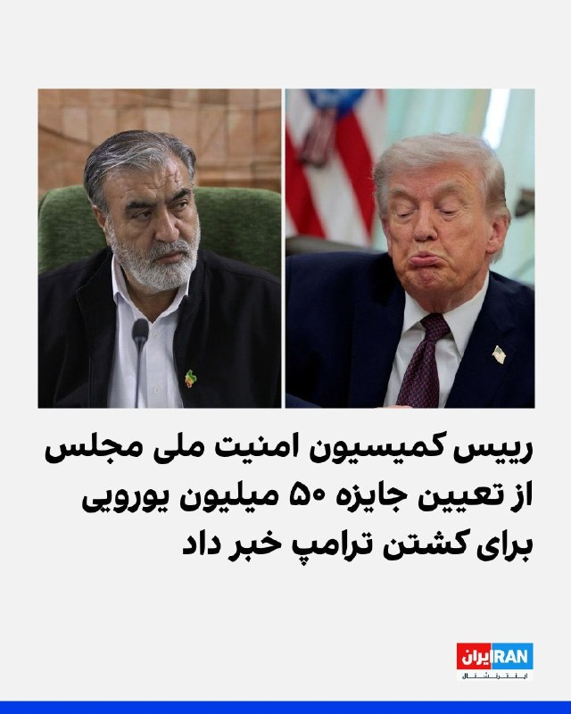

امیدوارم برسه به دست ترامپ.
عمویم خریت بچه ‌شیعه:

@Dirty_Kids 👻

## Hranews — post 112950

  

برخلاف پیمان‌نامه حقوق کودک؛ یک نوجوان در جریان آموزش‌های نظامی جان باخت

❗️
❗️
❗️
❗️
❗️– برخلاف تعهدات بین‌المللی ایران تحت عنوان الحاق به پیمان‌نامه حقوق #کودک و تعهدات مربوط به عدم به‌کارگیری کودکان در امور نظامی، یک پسر ۱۷ ساله در شهرستان دیر حین انجام آموزش‌های نظامی جان خود را از دست داد. رسانه‌های رسمی او را از نیروهای بسیج معرفی کردند.

ادامه مطلب

↘️
@hranews_bot تماس ✉️ - @Hranews کانال هرانا 🆑

## Hranews — post 112949

  

شیروان؛ هادی عباسیان توسط نیروهای امنیتی بازداشت شد

❗️
❗️
❗️
❗️
❗️– هادی عباسیان، شهروند اهل شهرستان شیروان روز چهارشنبه ۲۳ اردیبهشت‌ماه توسط نیروهای امنیتی بازداشت و به زندان این شهر منتقل شده است.

به گزارش خبرگزاری هرانا، ارگان خبری مجموعه فعالان حقوق بشر در ایران، هادی عباسیان بازداشت شد.

براساس اطلاعات دریافتی هرانا،‌ آقای عباسیان روز چهارشنبه ۲۳ اردیبهشت‌ماه در محله فرهنگ شهرستان شیروان بازداشت و پس از یک روز به زندان این شهر منتقل شده است.
#هادی_عباسیان

ادامه مطلب

↘️
@hranews_bot تماس ✉️ - @Hranews کانال هرانا 🆑

## Hranews — post 112948

  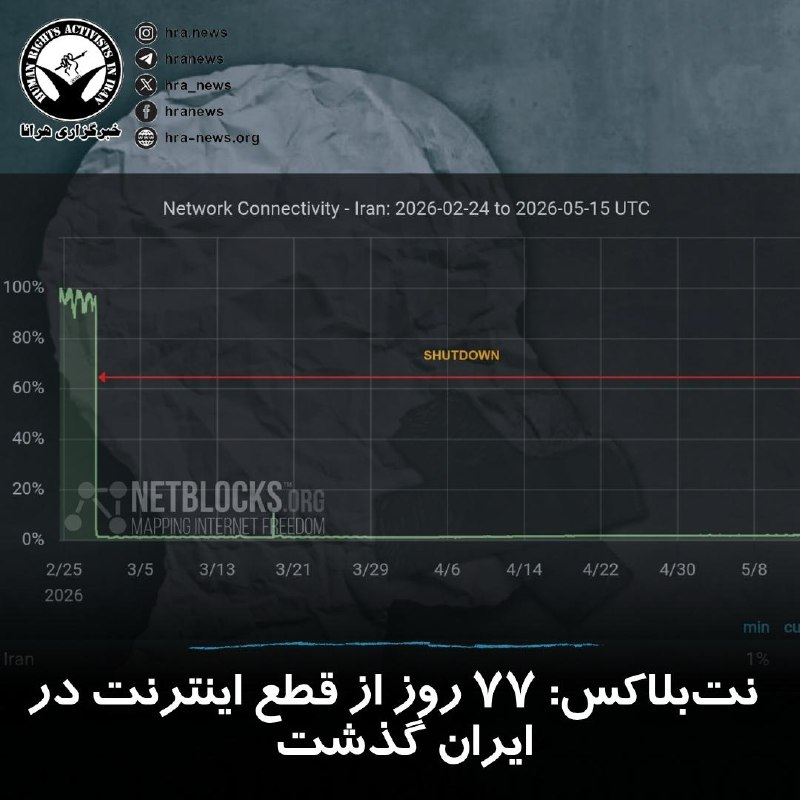

آخرین داده‌های نت بلاکس نشان می‌دهد که قطع #اینترنت در ایران با گذشت ۱۸۲۴ ساعت، وارد هفتاد و هفتمین روز خود شده است. این نهاد ناظر بر وضعیت دسترسی به اینترنت در جهان همچنین اعلام کرد: این وضعیت خطری نوظهور برای سلامت روان عموم مردم ایجاد می‌کند، مردمی که عمدتاً از پلتفرم‌های آنلاین، ارتباطات و تعامل عادی با دنیای خارج جدا شده‌اند.

↘️
@hranews_bot تماس ✉️ - @Hranews کانال هرانا 🆑

## manototv — post 105478

  <a href="telegram/content/manototv_105478_1778837477.mp4" target="_blank">🎬 Download video</a>

نارندرا مودی، نخست‌وزیر هند، روز جمعه ۲۵ اردیبهشت در جریان سفر به ابوظبی، با انتشار پیامی در شبکه اجتماعی ایکس نوشت: «دوستی میان هند و امارات بسیار نیرومند است.»

مودی در این سفر با شیخ محمد بن زاید، رئیس امارات متحده عربی، دیدار کرد. محور گفتگوهای دو طرف، گسترش روابط دوجانبه، همکاری‌های انرژی، همکاری‌های دفاعی و تحولات منطقه‌ای اعلام شده است.

این سفر در شرایطی انجام می‌شود که تنش‌های منطقه‌ای و نگرانی‌ها درباره امنیت مسیرهای انرژی، اهمیت همکاری میان هند و امارات را افزایش داده است. امارات یکی از شرکای مهم هند در حوزه انرژی و تجارت به شمار می‌رود و ابوظبی و دهلی نو در سال‌های اخیر روابط اقتصادی و راهبردی خود را گسترش داده‌اند.

## manototv — post 105477

  <a href="telegram/content/manototv_105477_1778837477.mp4" target="_blank">🎬 Download video</a>

عباس عراقچی، وزیر خارجه جمهوری اسلامی، در گفتگو با رسانه دولتی هند گفت «هیچ راه‌حل نظامی‌ای وجود ندارد» و افزود ایالات متحده باید این واقعیت را درک کند.

او گفت آمریکا «دست‌کم دو بار» جمهوری اسلامی را آزموده و اکنون به این نتیجه رسیده است که «راه‌حل نظامی وجود ندارد».

عراقچی مهم‌ترین مشکل در روند کنونی را «پیام‌های متناقض» از سوی مقام‌های آمریکایی دانست و گفت این پیام‌ها از طریق اظهارنظرها، مصاحبه‌ها و مواضع مختلف دریافت می‌شود.

## manototv — post 105476

  <a href="telegram/content/manototv_105476_1778837478.mp4" target="_blank">🎬 Download video</a>

رسانه دولتی اسرائیل گزارش داد ایال زامیر، رئیس ستاد ارتش اسرائیل، در جریان جنگ با ایران به امارات متحده عربی سفر کرده است.
بر اساس این گزارش، او همراه با چند مقام نظامی اسرائیل با مقام‌های اماراتی، از جمله محمد بن زاید، رئیس امارات، دیدار کرده است. ارتش اسرائیل تاکنون واکنشی به این گزارش نشان نداده است.
این گزارش پس از آن منتشر می‌شود که بنیامین نتانیاهو نیز گفته بود در زمان جنگ به امارات سفر کرده؛ ادعایی که از سوی امارات رد شد. همچنین گزارش‌هایی درباره سفر رؤسای سازمان‌های اطلاعاتی و امنیتی اسرائیل به امارات در زمان جنگ منتشر شده است.
در همین حال، مقام‌های آمریکایی تأیید کرده‌اند اسرائیل یک سامانه پدافند موشکی را به همراه نیروهای نظامی برای راه‌اندازی آن به امارات منتقل کرده است.

## manototv — post 105475

  <a href="telegram/content/manototv_105475_1778837479.mp4" target="_blank">🎬 Download video</a>

دفتر رسانه‌ای دولت ابوظبی روز جمعه ۲۵ اردیبهشت اعلام کرد امارات متحده عربی ساخت یک خط لوله نفتی تازه را برای افزایش صادرات از مسیر فجیره تسریع می‌کند.

این پروژه قرار است تا سال ۲۰۲۷ ظرفیت صادرات نفت امارات از فجیره را دو برابر کند و توان این کشور برای دور زدن تنگه هرمز را افزایش دهد.

فجیره در ساحل دریای عمان قرار دارد و نفتکش‌ها از این مسیر می‌توانند بدون عبور از تنگه هرمز بارگیری کنند.

## manototv — post 105474

  <a href="telegram/content/manototv_105474_1778837479.mp4" target="_blank">🎬 Download video</a>

گروه ناظر اینترنتی نت‌بلاکس اعلام کرد قطعی اینترنت در ایران امروز وارد هفتادوهفتمین روز خود شده و از مرز ۱۸۲۴ ساعت گذشته است.
نت‌بلاکس هشدار داده ادامه این محدودیت‌ها می‌تواند به یک خطر فزاینده برای سلامت روان شهروندان تبدیل شود؛ شهروندانی که تا حد زیادی از پلتفرم‌های آنلاین، ارتباطات و تعامل عادی با جهان خارج محروم شده‌اند.

## manototv — post 105473

  <a href="telegram/content/manototv_105473_1778837480.mp4" target="_blank">🎬 Download video</a>

دونالد ترامپ، رئیس‌جمهوری آمریکا، پس از پایان سفر دو روزه خود به چین، روز جمعه پکن را ترک کرد.
ترامپ با هواپیمای اختصاصی ریاست‌جمهوری آمریکا «ایر فورس وان» از چین خارج شد و وانگ یی، وزیر امور خارجه چین، به همراه هیاتی دیپلماتیک او را بدرقه کرد.

## manototv — post 105472

  <a href="telegram/content/manototv_105472_1778837481.mp4" target="_blank">🎬 Download video</a>

اف‌بی‌آی اعلام کرد برای دریافت اطلاعاتی که به شناسایی و بازداشت «مونیکا ویت»، مامور سابق ضدجاسوسی و متخصص اطلاعاتی نیروی هوایی آمریکا، منجر شود ۲۰۰ هزار دلار جایزه تعیین کرده است.
بر اساس بیانیه اف‌بی‌آی، ویت بین سال‌های ۱۹۹۷ تا ۲۰۰۸ در نیروی هوایی آمریکا خدمت کرده و سپس تا سال ۲۰۱۰ به‌عنوان پیمانکار دولت آمریکا فعالیت داشته است. او به اطلاعات محرمانه و فوق‌محرمانه، از جمله هویت نیروهای مخفی جامعه اطلاعاتی آمریکا، دسترسی داشته است. مقام‌های آمریکایی می‌گویند او پس از شرکت در نشست‌هایی مرتبط با برنامه «افق نو» در تهران، به ایران پناهنده شد و اطلاعات حساسی را در اختیار جمهوری اسلامی قرار داد.
وزارت دادگستری آمریکا پیش‌تر او را به همکاری در عملیات جاسوسی سایبری، افشای اطلاعات محرمانه و به خطر انداختن جان نیروهای آمریکایی و خانواده‌هایشان متهم کرده بود. اف‌بی‌آی می‌گوید مونیکا ویت همچنان متواری است و احتمال می‌دهد افرادی از محل اختفای او اطلاع داشته باشند.

## manototv — post 105471

  <a href="telegram/content/manototv_105471_1778837482.mp4" target="_blank">🎬 Download video</a>

ارتش اسرائیل اعلام کرد در پی فعال شدن آژیر هشدار در مناطق مسد و عیلابون، یک پرتابه شلیک‌شده از خاک لبنان به سوی اسرائیل رهگیری شده است. به گفته ارتش اسرائیل، این اقدام «نقض دیگری از تفاهم‌های آتش‌بس» از سوی حزب‌الله به شمار می‌رود.
همزمان ارتش اسرائیل اعلام کرد یک سرباز این کشور شب گذشته بر اثر شلیک خمپاره حزب‌الله در جنوب لبنان کشته شده است. سرباز کشته‌شده، گروهبان دوم نگو داگان، ۲۰ ساله، از گردان دوازدهم تیپ گولانی و اهل شهرک دکل در جنوب اسرائیل معرفی شده است.
ارتش اسرائیل همچنین اعلام کرد شب گذشته سکوی پرتابی را که حزب‌الله از آن چندین راکت به سوی منطقه کریات شمونا شلیک کرده بود، در منطقه زبدین در جنوب لبنان هدف قرار داده و منهدم کرده است. به گفته ارتش، چندین ساختمان مورد استفاده حزب‌الله برای اهداف نظامی نیز در این حملات هدف قرار گرفته‌اند.

## manototv — post 105470

  <a href="telegram/content/manototv_105470_1778837483.mp4" target="_blank">🎬 Download video</a>

ویدئویی از قدم زدن دونالد ترامپ و شی جین‌پینگ در باغ‌های مجموعه حکومتی ژونگ‌نان‌های در پکن منتشر شده است.
در این ویدئو، ترامپ از رئیس‌جمهوری چین می‌پرسد: «وقتی دیگر رؤسای کشورها به دیدارتان می‌آیند، آن‌ها را هم اینجا می‌پذیرید؟»
شی جین‌پینگ در پاسخ می‌گوید: «به ندرت می‌آیند».

## manototv — post 105469

  <a href="telegram/content/manototv_105469_1778837485.mp4" target="_blank">🎬 Download video</a>

دونالد ترامپ پس از دیدار با شی جین‌پینگ اعلام کرد آمریکا و چین درباره ایران دیدگاه‌های «بسیار مشابهی» دارند و هر دو خواهان پایان تنش‌ها و باز ماندن تنگه هرمز هستند.
ترامپ گفت: «نمی‌خواهیم ایران به سلاح هسته‌ای دست پیدا کند.» او همچنین وضعیت کنونی را «دیوانه‌وار» توصیف کرد و افزود واشینگتن خواهان پایان بحران است.
رئیس‌جمهوری آمریکا همچنین با اشاره به روابط خود با شی جین‌پینگ گفت دو طرف طی سال‌های گذشته توانسته‌اند مشکلاتی را حل کنند که دیگران قادر به حل آن‌ها نبودند و تاکید کرد روابط میان واشینگتن و پکن همچنان «بسیار قوی» است.

## manototv — post 105468

  <a href="telegram/content/manototv_105468_1778837487.mp4" target="_blank">🎬 Download video</a>

مقام‌های فنلاند روز جمعه درباره فعالیت مشکوک پهپادی در منطقه پایتخت هشدار دادند و فرودگاه هلسینکی اعلام کرد پروازها به‌طور موقت متوقف شده است.
پتری اورپو، نخست‌وزیر فنلاند، در پیامی در شبکه اجتماعی ایکس اعلام کرد: «مقام‌ها در حال اقدام هستند. نیروهای مسلح نیز توان نظارتی و واکنش خود را تقویت کرده‌اند. از همه می‌خواهم اطلاعیه‌های رسمی را دنبال کنند.

## alonews — post 120127

  <a href="telegram/content/alonews_120127_1778837487.webm" target="_blank">🎬 Download video</a>

👈خنثی‌سازی بمب یک‌تنی در شهرستان دلفان لرستان

✅ @AloNews خبر جنگ

## alonews — post 120126

  <a href="telegram/content/alonews_120126_1778837487.webm" target="_blank">🎬 Download video</a>

👈بلومبرگ: امارات متحده عربی تلاش کرد عربستان سعودی، قطر و دیگر همسایگان خلیجی را به پیوستن به یک واکنش نظامی هماهنگ علیه ایران ترغیب کند، اما رد شد.

🔴شیخ محمد بن زاید شخصاً با محمد بن سلمان و دیگر رهبران تماس گرفت.

🔴هیچ‌کدام موافقت به مشارکت نکردند.

🔴در نهایت امارات عمدتاً به تنهایی عمل کرد

✅ @AloNews خبر جنگ

## alonews — post 120124

  <a href="telegram/content/alonews_120124_1778837488.mp4" target="_blank">🎬 Download video</a>

👈حملات امروز به کرد های عراق

✅ @AloNews خبر جنگ

## alonews — post 120123

  <a href="telegram/content/alonews_120123_1778837489.webm" target="_blank">🎬 Download video</a>

👈روزنامه گاردین با اتمام سفر رئیس جمهور آمریکا به چین در گزارشی اعلام کرد: توافق ترامپ-شی درباره ایران دست‌نیافتنی باقی ماند.

✅ @AloNews خبر جنگ

## alonews — post 120122

  <a href="telegram/content/alonews_120122_1778837489.webm" target="_blank">🎬 Download video</a>

👈کوبا اعلام کرد رئیس سازمان سیا به این کشور سفر کرده است

✅ @AloNews خبر جنگ

## alonews — post 120121

## alonews — post 120120

## alonews — post 120119

  <a href="telegram/content/alonews_120119_1778837490.webm" target="_blank">🎬 Download video</a>

👈دستگیری ۲۲۳ نفر از اتباع بیگانه غیرمجاز در زاهدان

✅ @AloNews خبر جنگ

## alonews — post 120118

  <a href="telegram/content/alonews_120118_1778837490.webm" target="_blank">🎬 Download video</a>

👈 فایننشال‌تایمز: اگر تا ماه آینده تنگهٔ هرمز باز نشود، به‌دلیل تخلیهٔ ذخایر استراتژیک شاهد موج گسترده‌تری از کمبودهای جهانی و افزایش قیمت‌ها در حوزهٔ انرژی خواهیم بود

✅ @AloNews خبر جنگ

## alonews — post 120117

  <a href="telegram/content/alonews_120117_1778837490.webm" target="_blank">🎬 Download video</a>

👈خبرنگار الجزیره: تهران به‌طور رسمی پاسخ واشنگتن به پیشنهاد خود را دریافت کرده است و ایالات متحده تمامی شروط ایران را رد کرده است

✅ @AloNews خبر جنگ

## alonews — post 120116

  <a href="telegram/content/alonews_120116_1778837491.webm" target="_blank">🎬 Download video</a>

👈امارات ظرفیت صادرات نفت بدون عبور از تنگه هرمز را دو برابر می‌کند

🔴امارات متحده عربی اعلام کرد تا سال ۲۰۲۷ ظرفیت صادرات نفت خام خود بدون نیاز به عبور از تنگه هرمز را دو برابر خواهد کرد.

🔴بر اساس گزارش‌ها: شرکت ملی نفت ابوظبی در حال ساخت خط لوله جدیدی به بندر فجیره در دریای عمان است

🔴هدف این پروژه کاهش وابستگی به تنگه هرمز عنوان شده است

🔴بسته‌شدن مسیر هرمز در جریان جنگ اخیر علیه ایران، بازارهای جهانی را دچار بحران کرده است.

🔴امارات هم‌اکنون نیز یک خط لوله با ظرفیت روزانه ۱.۵ میلیون بشکه از میادین نفتی داخلی به بندر فجیره در اختیار دارد.

✅ @AloNews خبر جنگ

## alonews — post 120115

  <a href="telegram/content/alonews_120115_1778837491.mp4" target="_blank">🎬 Download video</a>

👈عراقچی : مشکل اصلی اینه که آمریکا هر روز یه حرف می‌زنه و پیام‌های ضدونقیض می‌فرسته

🔴در مورد ایران هیچ راه‌حل نظامی‌ای جواب نمی‌ده

🔴 این همه مدت هی تهدید کردن، ولی نه نتیجه‌ای گرفتن نه از جنگی که راه انداختن چیزی گیرشون اومد

🔴هرچی بیشتر تهدید کنن، بیشتر شکست می‌خورن.

✅ @AloNews خبر جنگ

## alonews — post 120114

  <a href="telegram/content/alonews_120114_1778837493.webm" target="_blank">🎬 Download video</a>

👈هواپیماهای باری نظامی آذربایجان از طریق حریم هوایی ترکیه به سمت تل آویو در حرکت هستند.

✅ @AloNews خبر جنگ

## alonews — post 120113

  <a href="telegram/content/alonews_120113_1778837493.webm" target="_blank">🎬 Download video</a>

👈جنوب لبنان، ساعاتی قبل

✅ @AloNews خبر جنگ

## alonews — post 120112

  <a href="telegram/content/alonews_120112_1778837493.webm" target="_blank">🎬 Download video</a>

👈صدای چند انفجار در اربیل 
✅ @AloNews خبر جنگ

## alonews — post 120111

  <a href="telegram/content/alonews_120111_1778837494.webm" target="_blank">🎬 Download video</a>

👈سخنگوی وزارت امور خارجه چین: درگیری بین ایران و ایالات متحده از همان ابتدا هرگز نباید رخ می‌داد و نیازی به ادامه آن نیست

🔴یافتن راه‌حل در اسرع وقت به نفع ایالات متحده، ایران، کشورهای منطقه و جهان است

✅ @AloNews خبر جنگ

## alonews — post 120110

  <a href="telegram/content/alonews_120110_1778837494.webm" target="_blank">🎬 Download video</a>

👈سازمان پخش اسرائیل: ایال زمیر، رئیس ستاد کل ارتش اسرائیل، در طول جنگ با ایران مخفیانه از امارات متحده عربی بازدید و با محمد بن زاید، دیدار کرد

✅ @AloNews خبر جنگ

## alonews — post 120109

  <a href="telegram/content/alonews_120109_1778837494.webm" target="_blank">🎬 Download video</a>

👈سخنگوی صنعت آب: ناچار به مدیریت مصرف به روش‌های مختلف هستیم تا بتوانیم آب را تأمین کنیم، از جمله افت فشار آب

✅ @AloNews خبر جنگ

## alonews — post 120108

  <a href="telegram/content/alonews_120108_1778837494.webm" target="_blank">🎬 Download video</a>

👈صدای چند انفجار در اربیل

✅ @AloNews خبر جنگ

<!-- MSG END -->

<!-- NAV START -->

<a href="https://github.com/BEST8OY/aio-downloader/blob/main/telegram/content/archive_1.md" style="display:inline-block; padding:6px 12px; margin:0 4px; background-color:#2ea44f; color:white; text-decoration:none; border-radius:4px; font-weight:bold;">صفحه بعد</a>

<!-- NAV END -->
